# Kuaai — Documentación de Arquitectura e Implementación

**Proyecto:** Kuaai Intelligent HRMS  
**Autor:** Mariano David Rodriguez  
**Universidad:** Universidad Nacional de Misiones (UNaM)  
**Tipo:** MVP — Proyecto Final de Grado  

---

## Índice

1. [Visión general del sistema](#1-visión-general-del-sistema)
2. [Fase 1 — Infraestructura base](#2-fase-1--infraestructura-base)
3. [Fase 2 — Backend NestJS](#3-fase-2--backend-nestjs)
4. [Fase 3 — Backend FastAPI + Agente RAG](#4-fase-3--backend-fastapi--agente-rag)
5. [Modelo de datos](#5-modelo-de-datos)
6. [Flujos de operación críticos](#6-flujos-de-operación-críticos)

---

## 1. Visión general del sistema

Kuaai combina tres patrones arquitectónicos:

- **Event-Driven:** el nodo IoT publica eventos MQTT que NestJS consume asincrónicamente.
- **Cliente-Servidor (3 capas con proxy):** Next.js habla **únicamente** con NestJS. NestJS actúa como API gateway: maneja auth, CRUD y dashboard directamente, y hace de proxy hacia FastAPI para documentos y chat.
- **Agéntico (Agentic RAG):** el agente LangChain orquesta herramientas en tiempo de ejecución para responder consultas en lenguaje natural.

### Diagrama — Nivel 1: Contexto del sistema

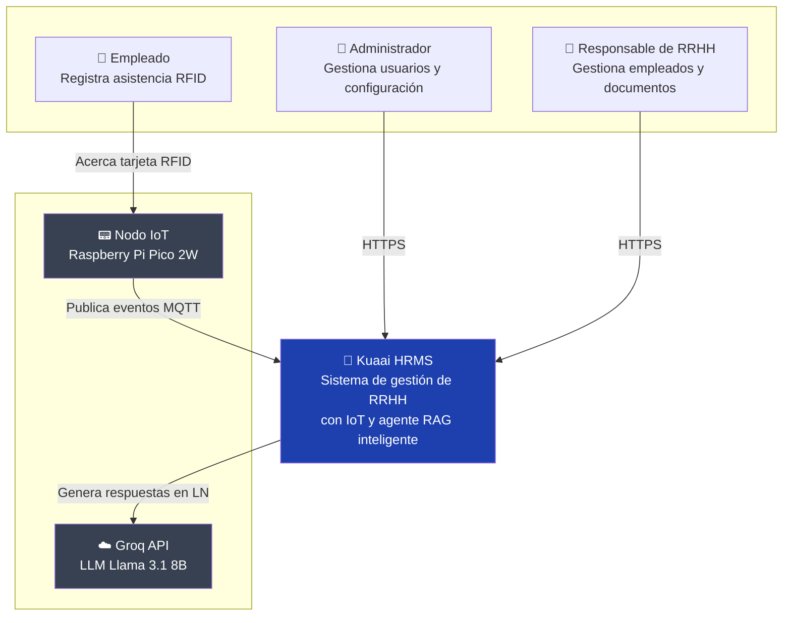

### Diagrama — Nivel 2: Contenedores (servicios)

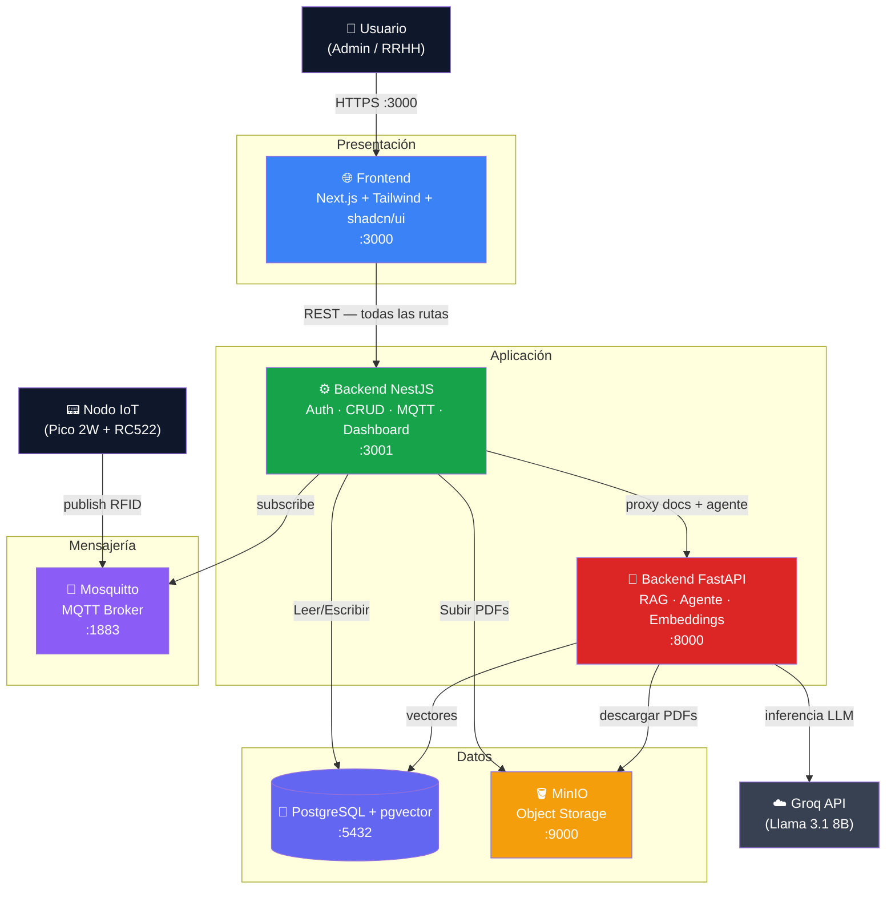

---

## 2. Fase 1 — Infraestructura base

### Estructura del monorepo

```
kuaai-intelligent-hrms/
├── apps/
│   ├── frontend/           # Next.js 16 + Tailwind + shadcn/ui
│   ├── backend-nest/       # NestJS — Auth, CRUD, MQTT, Dashboard
│   ├── backend-fastapi/    # FastAPI — RAG, Agente, Embeddings
│   └── iot-node/           # MicroPython — Raspberry Pi Pico 2W
├── infra/
│   ├── postgres/
│   │   └── init.sql        # CREATE EXTENSION vector + 6 tablas
│   ├── minio/
│   │   └── init-minio.sh   # Crea bucket 'documents'
│   └── mosquitto/
│       └── mosquitto.conf  # Listener 1883, allow_anonymous
├── docker-compose.yml
├── docker-compose.dev.yml
├── .env.example
├── .gitignore
└── PLAN.md
```

### Diagrama de deployment (Docker Compose)

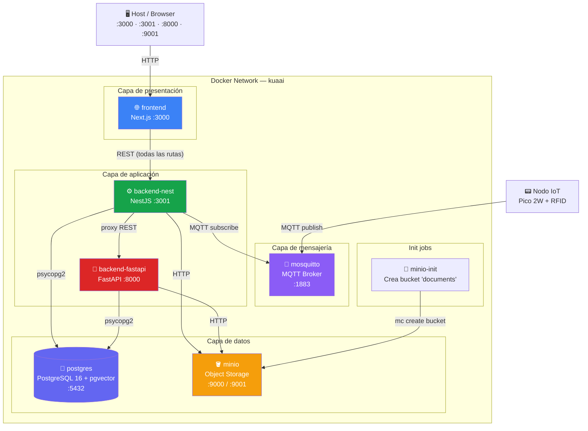

### Variables de entorno clave (.env)

| Variable | Valor por defecto | Descripción |
|---|---|---|
| `POSTGRES_HOST` | `postgres` | Host del contenedor PostgreSQL |
| `POSTGRES_DB` | `kuaai` | Nombre de la base de datos |
| `MINIO_BUCKET_DOCUMENTS` | `documents` | Bucket para PDFs |
| `MQTT_TOPIC_ATTENDANCE` | `attendance/checkin` | Topic MQTT del nodo IoT |
| `GROQ_API_KEY` | — | API key de Groq (requerida) |
| `JWT_SECRET` | — | Secret para firmar JWT (requerido) |
| `EMBEDDINGS_MODEL` | `all-MiniLM-L6-v2` | Modelo de embeddings (384 dims) |

---

## 3. Fase 2 — Backend NestJS

### Diagrama de módulos

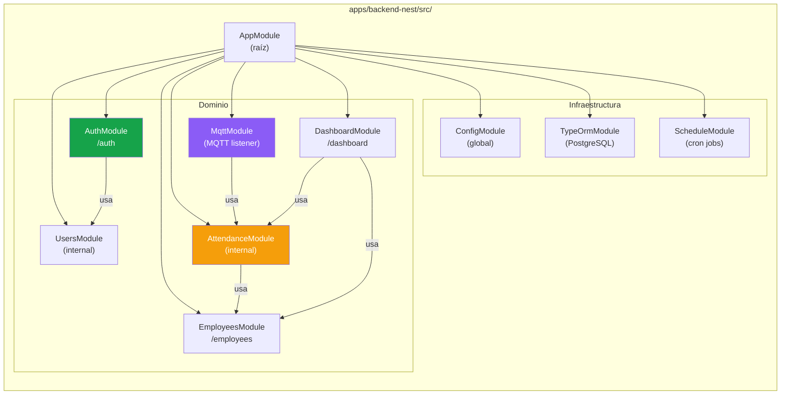

### Endpoints expuestos

| Método | Ruta | Guard | Descripción |
|--------|------|-------|-------------|
| `POST` | `/auth/login` | Público | Retorna JWT |
| `GET` | `/auth/me` | JWT | Usuario autenticado |
| `POST` | `/auth/logout` | JWT | Cierra sesión |
| `GET` | `/employees` | JWT | Lista paginada con filtros |
| `GET` | `/employees/:id` | JWT | Detalle de empleado |
| `POST` | `/employees` | JWT | Crear empleado |
| `PUT` | `/employees/:id` | JWT | Editar empleado |
| `DELETE` | `/employees/:id` | JWT | Dar de baja (→ INACTIVO) |
| `GET` | `/dashboard/today` | JWT | Asistencia del día |
| `GET` | `/dashboard/monthly-average` | JWT | Promedio mensual |
| `GET` | `/dashboard/tardiness` | JWT | Reporte de tardanzas |

### Lógica de asistencia (AttendanceService)

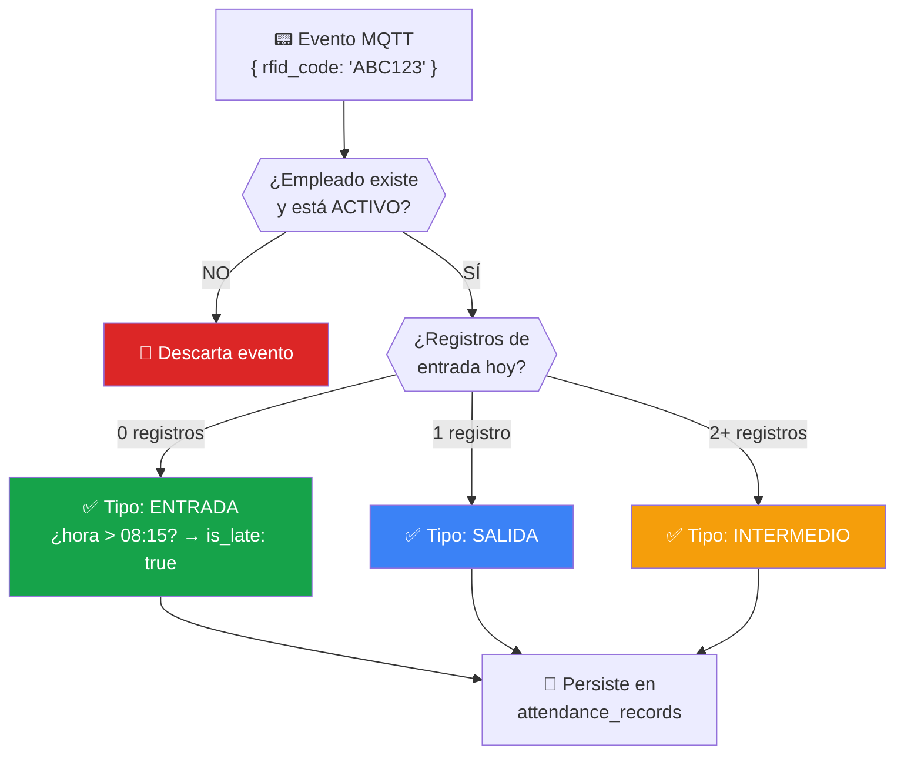

**Cron job — Salida automática (16:00, lun-vie):**  
Para cada empleado activo con ENTRADA registrada pero sin SALIDA, se genera automáticamente un registro con `auto_generated: true`.

### Entidades TypeORM

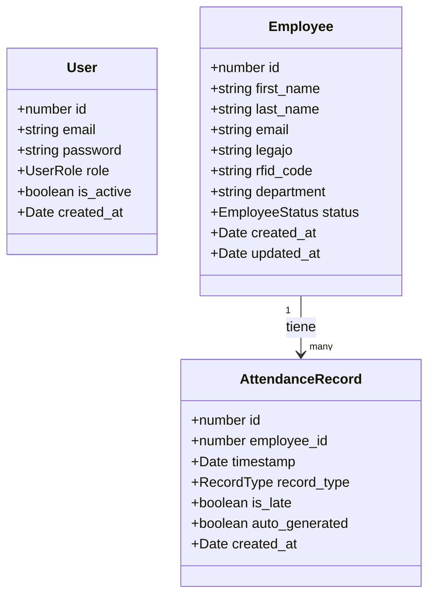

---

## 4. Fase 3 — Backend FastAPI + Agente RAG

### Diagrama de módulos

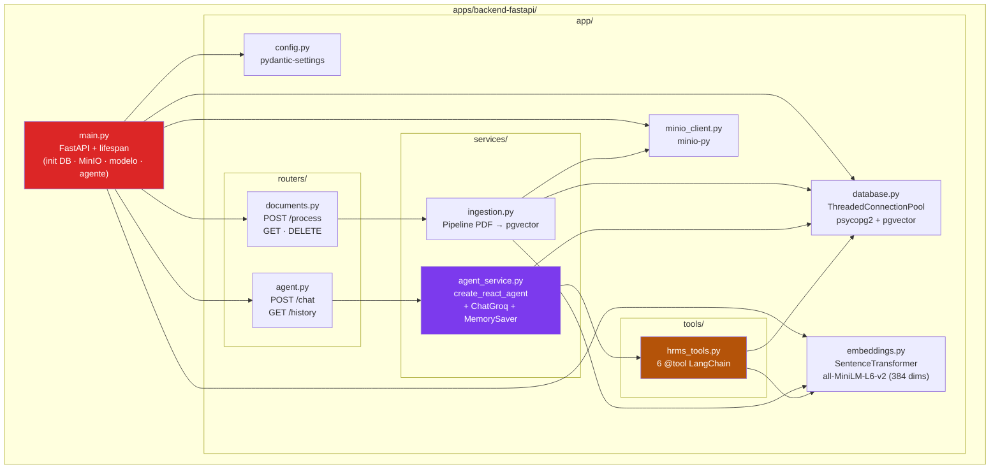

### Pipeline de ingestión de documentos

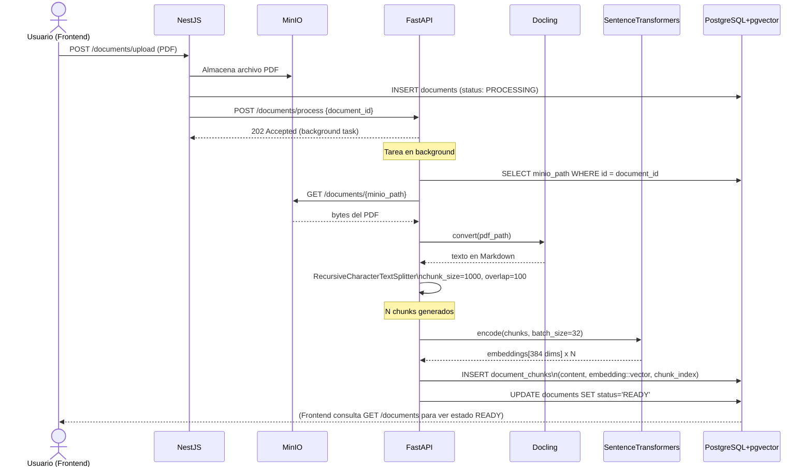

### Flujo del agente RAG

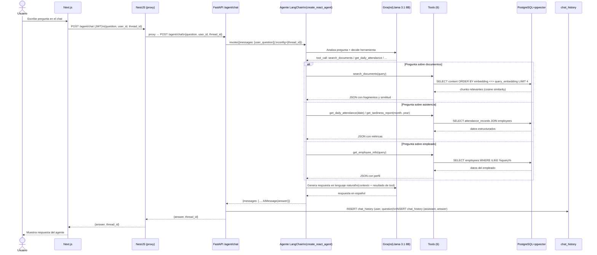

### Herramientas del agente (6 @tool)

| Herramienta | Descripción | Fuente de datos |
|---|---|---|
| `search_documents` | Búsqueda semántica en documentos empresariales | pgvector (cosine similarity) |
| `get_daily_attendance` | Asistencia del día: presentes, ausentes, tardanzas | `attendance_records` |
| `get_employee_attendance` | Resumen mensual de un empleado | `attendance_records` |
| `get_tardiness_report` | Empleados con tardanzas en el mes | `attendance_records` |
| `get_monthly_summary` | Estadísticas generales del mes | `attendance_records` |
| `get_employee_info` | Búsqueda de empleado por nombre/legajo | `employees` |

### Endpoints FastAPI

| Método | Ruta | Descripción |
|--------|------|-------------|
| `POST` | `/documents/register` | Registra documento (status: PROCESSING) |
| `POST` | `/documents/process` | Lanza pipeline ingestión en background |
| `GET` | `/documents/` | Lista todos los documentos |
| `GET` | `/documents/:id` | Detalle de documento |
| `DELETE` | `/documents/:id` | Elimina documento y sus chunks |
| `POST` | `/agent/chat` | Consulta al agente RAG |
| `GET` | `/agent/history/:user_id` | Historial de conversación |
| `GET` | `/health` | Health check |

---

## 5. Modelo de datos

### Diagrama entidad-relación

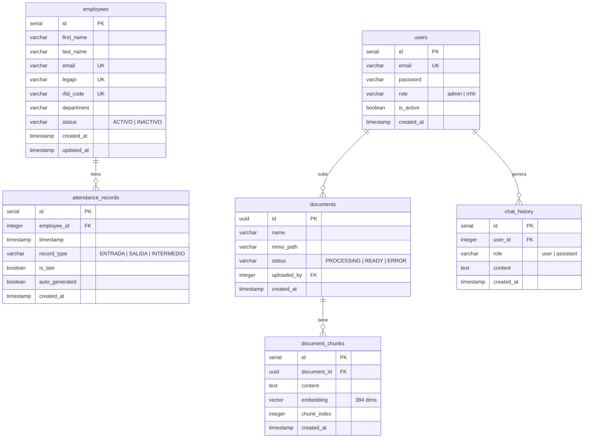

---

## 6. Flujos de operación críticos

### Flujo 1 — Login y autenticación

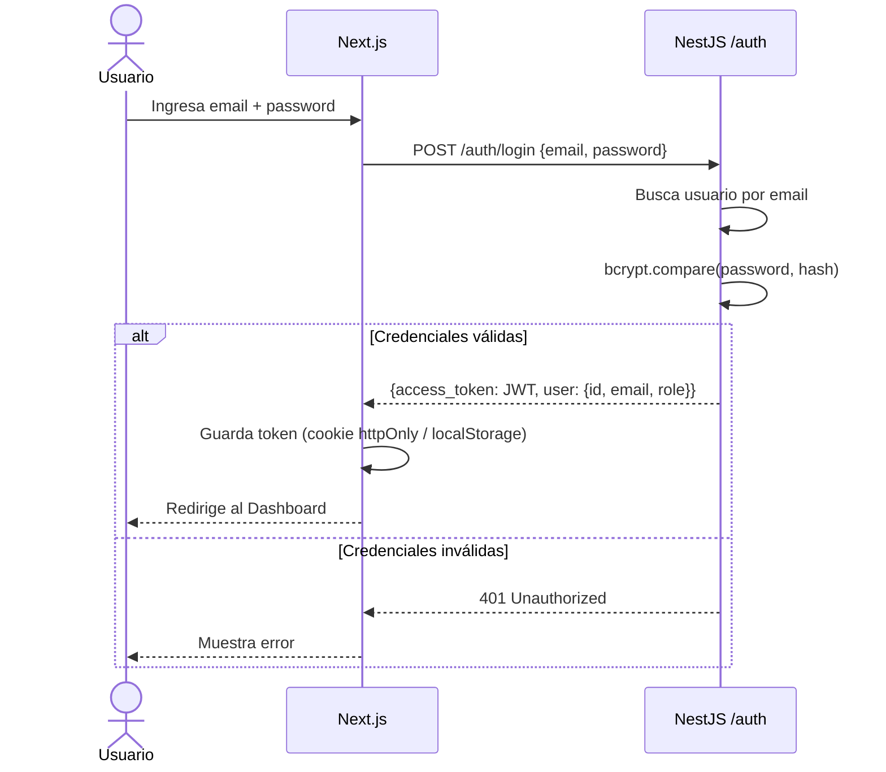

### Flujo 2 — Registro RFID IoT

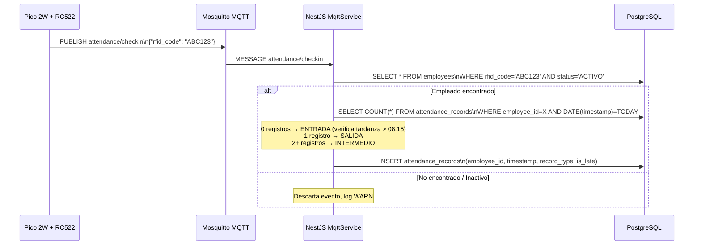

---

*Generado con el skill `aj-geddes/useful-ai-prompts@architecture-diagrams`*  
*Diagramas en formato Mermaid — renderizables en GitHub, GitLab, Notion, Obsidian*
