# Kuaai — Documentación de Arquitectura e Implementación

**Proyecto:** Kuaai Intelligent HRMS  
**Autor:** Mariano David Rodriguez  
**Universidad:** Universidad Nacional de Misiones (UNaM)  
**Tipo:** MVP — Proyecto Final de Grado  

---

## Índice

1. [Visión general del sistema](#1-visión-general-del-sistema)
   - [Diagrama — Nivel 1: Contexto del sistema](#diagrama--nivel-1-contexto-del-sistema)
   - [Diagrama — Nivel 2: Contenedores (servicios)](#diagrama--nivel-2-contenedores-servicios)
2. [Fase 1 — Infraestructura base](#2-fase-1--infraestructura-base)
   - [Estructura del monorepo](#estructura-del-monorepo)
   - [Diagrama de deployment (Docker Compose)](#diagrama-de-deployment-docker-compose)
   - [Variables de entorno clave (.env)](#variables-de-entorno-clave-env)
3. [Fase 2 — Backend NestJS](#3-fase-2--backend-nestjs)
   - [Diagrama de módulos](#diagrama-de-módulos)
   - [Endpoints expuestos](#endpoints-expuestos)
   - [Lógica de asistencia (AttendanceService)](#lógica-de-asistencia-attendanceservice)
   - [Entidades TypeORM](#entidades-typeorm)
4. [Fase 3 — Backend FastAPI + Agente RAG](#4-fase-3--backend-fastapi--agente-rag)
   - [Diagrama de módulos](#diagrama-de-módulos-1)
   - [Pipeline de ingestión de documentos](#pipeline-de-ingestión-de-documentos)
   - [Flujo del agente RAG](#flujo-del-agente-rag)
   - [Herramientas del agente (6 tools LangChain)](#herramientas-del-agente-6-tools-langchain)
   - [Endpoints FastAPI](#endpoints-fastapi)
   - [Hilos de conversación y logs de sistema (Sprints 2/3)](#hilos-de-conversación-y-logs-de-sistema-sprints-23)
5. [Fase 4 — Frontend Next.js](#5-fase-4--frontend-nextjs)
   - [Stack](#stack)
   - [Estructura de rutas (App Router)](#estructura-de-rutas-app-router)
   - [Sesión: cookie + localStorage, no uno solo](#sesión-cookie--localstorage-no-uno-solo)
   - [Páginas principales](#páginas-principales)
6. [Fase 5 — Nodo IoT (Raspberry Pi Pico 2W)](#6-fase-5--nodo-iot-raspberry-pi-pico-2w)
   - [Hardware](#hardware)
   - [Estructura de archivos](#estructura-de-archivos)
   - [Flujo del firmware](#flujo-del-firmware)
   - [Por qué `mqtt_as` y no `umqtt.simple`](#por-qué-mqtt_as-y-no-umqttsimple)
7. [Modelo de datos](#7-modelo-de-datos)
   - [Diagrama entidad-relación](#diagrama-entidad-relación)
8. [Flujos de operación críticos](#8-flujos-de-operación-críticos)
   - [Flujo 1 — Login y autenticación](#flujo-1--login-y-autenticación)
   - [Flujo 2 — Registro RFID IoT](#flujo-2--registro-rfid-iot)
9. [Seguridad](#9-seguridad)
   - [Autenticación (JWT)](#autenticación-jwt)
   - [Autorización (guards y roles)](#autorización-guards-y-roles)
   - [Contraseñas](#contraseñas)
   - [Límite de confianza NestJS / FastAPI](#límite-de-confianza-nestjs--fastapi)
   - [Cabeceras de seguridad HTTP](#cabeceras-de-seguridad-http)
   - [Carga y validación de variables de entorno](#carga-y-validación-de-variables-de-entorno)
   - [Otros mecanismos](#otros-mecanismos)
   - [Gaps conocidos (pendientes)](#gaps-conocidos-pendientes)
10. [Referencias](#10-referencias)

---

## 1. Visión general del sistema

Kuaai combina tres patrones arquitectónicos:

- **Event-Driven:** el nodo IoT publica eventos MQTT que NestJS consume asincrónicamente.
- **Cliente-Servidor (3 capas con proxy):** Next.js habla **únicamente** con NestJS. NestJS actúa como API gateway: maneja auth, CRUD y dashboard directamente, y hace de proxy hacia FastAPI para documentos y chat.
- **Agéntico (Agentic RAG):** el agente LangGraph (`create_react_agent`) orquesta herramientas de LangChain en tiempo de ejecución para responder consultas en lenguaje natural.

### Diagrama — Nivel 1: Contexto del sistema

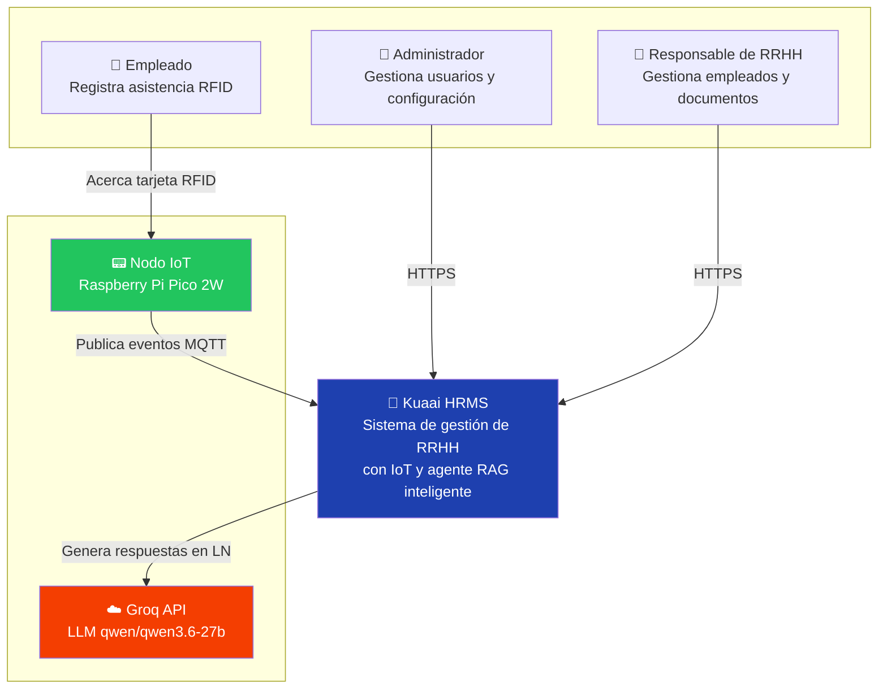
```mermaid
graph TB
    subgraph USERS [" "]
        ADMIN["👤 Administrador\nGestiona usuarios y configuración"]
        RRHH["👤 Responsable de RRHH\nGestiona empleados y documentos"]
        EMP["👷 Empleado\nRegistra asistencia RFID"]
    end

    KUAAI["🏢 Kuaai HRMS\nSistema de gestión de RRHH\ncon IoT y agente RAG inteligente"]

    subgraph EXT [" "]
        GROQ["☁️ Groq API\nLLM qwen/qwen3.6-27b"]
        IOT_CTX["📟 Nodo IoT\nRaspberry Pi Pico 2W"]
    end

    ADMIN -->|"HTTPS"| KUAAI
    RRHH  -->|"HTTPS"| KUAAI
    EMP   -->|"Acerca tarjeta RFID"| IOT_CTX
    IOT_CTX -->|"Publica eventos MQTT"| KUAAI
    KUAAI -->|"Genera respuestas en LN"| GROQ

    style KUAAI fill:#1e40af,color:#fff
    style GROQ  fill:#F43E01,color:#fff
    style IOT_CTX fill:#22C55E,color:#fff
```

### Diagrama — Nivel 2: Contenedores (servicios)

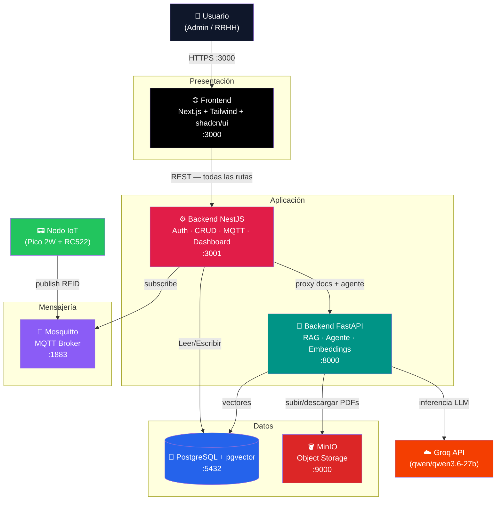
```mermaid
graph TB
    USER["👤 Usuario\n(Admin / RRHH)"]
    IOT["📟 Nodo IoT\n(Pico 2W + RC522)"]
    GROQ["☁️ Groq API\n(qwen/qwen3.6-27b)"]

    subgraph PRES ["Presentación"]
        FE["🌐 Frontend\nNext.js + Tailwind + shadcn/ui\n:3000"]
    end

    subgraph APP ["Aplicación"]
        NEST["⚙️ Backend NestJS\nAuth · CRUD · MQTT · Dashboard\n:3001"]
        FAPI["🤖 Backend FastAPI\nRAG · Agente · Embeddings\n:8000"]
    end

    subgraph MSG ["Mensajería"]
        MQTT["📡 Mosquitto\nMQTT Broker\n:1883"]
    end

    subgraph DATA ["Datos"]
        PG[("🐘 PostgreSQL + pgvector\n:5432")]
        MINIO["🪣 MinIO\nObject Storage\n:9000"]
    end

    USER  -->|"HTTPS :3000"| FE
    FE    -->|"REST — todas las rutas"| NEST
    NEST  -->|"proxy docs + agente"| FAPI
    NEST  -->|"Leer/Escribir"| PG
    NEST  -->|"subscribe"| MQTT
    FAPI  -->|"vectores"| PG
    FAPI  -->|"subir/descargar PDFs"| MINIO
    FAPI  -->|"inferencia LLM"| GROQ
    IOT   -->|"publish RFID"| MQTT

    style FE   fill:#000000,color:#fff
    style NEST fill:#e11d48,color:#fff
    style FAPI fill:#009486,color:#fff
    style PG   fill:#2563EB,color:#fff
    style MINIO fill:#DC2626,color:#fff
    style MQTT fill:#8B5CF6,color:#fff
    style USER fill:#0f172a,color:#fff
    style IOT  fill:#22C55E,color:#fff
    style GROQ fill:#F43E01,color:#fff
```

---

## 2. Fase 1 — Infraestructura base

### Estructura del monorepo

```
kuaai-intelligent-hrms/
├── apps/
│   ├── frontend/           # Next.js 16 + Tailwind + shadcn/ui
│   ├── backend-nest/       # NestJS — Auth, CRUD, MQTT, Dashboard
│   ├── backend-fastapi/    # FastAPI — RAG, Agente, Embeddings
│   └── iot-node/           # MicroPython — Raspberry Pi Pico 2W
├── infra/
│   ├── postgres/
│   │   └── init.sql        # CREATE EXTENSION vector + 6 tablas
│   ├── minio/
│   │   └── init-minio.sh   # Crea bucket 'documents'
│   └── mosquitto/
│       └── mosquitto.conf  # Listener 1883, allow_anonymous
├── docker-compose.yml
├── docker-compose.dev.yml
├── .env.example
├── .gitignore
├── ARCHITECTURE.md      # este documento
└── DESIGN.md
```

### Diagrama de deployment (Docker Compose)

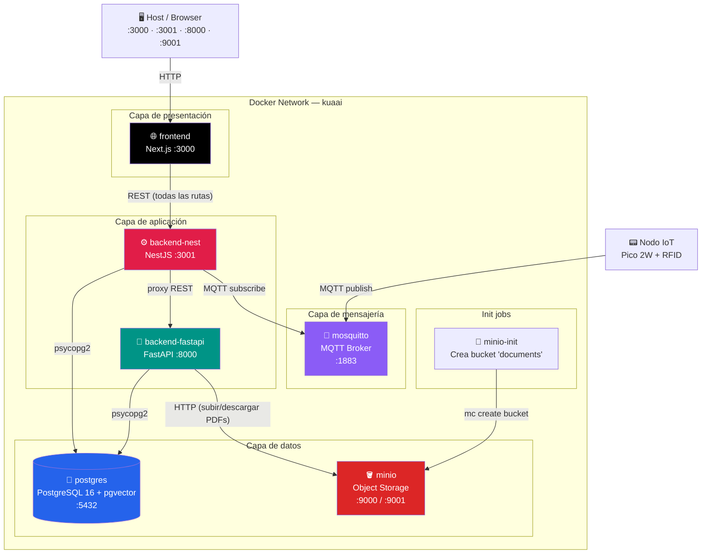
```mermaid
graph TB
    subgraph "Docker Network — kuaai"
        direction TB

        subgraph "Capa de presentación"
            FE["🌐 frontend\nNext.js :3000"]
        end

        subgraph "Capa de aplicación"
            NEST["⚙️ backend-nest\nNestJS :3001"]
            FAPI["🤖 backend-fastapi\nFastAPI :8000"]
        end

        subgraph "Capa de mensajería"
            MQTT["📡 mosquitto\nMQTT Broker\n:1883"]
        end

        subgraph "Capa de datos"
            PG[("🐘 postgres\nPostgreSQL 16 + pgvector\n:5432")]
            MINIO["🪣 minio\nObject Storage\n:9000 / :9001"]
        end

        subgraph "Init jobs"
            MINIO_INIT["🔧 minio-init\nCrea bucket 'documents'"]
        end
    end

    HOST["🖥️ Host / Browser\n:3000 · :3001 · :8000 · :9001"]
    IOT["📟 Nodo IoT\nPico 2W + RFID"]

    HOST -->|"HTTP"| FE
    FE -->|"REST (todas las rutas)"| NEST
    NEST -->|"proxy REST"| FAPI
    NEST -->|"psycopg2"| PG
    NEST -->|"MQTT subscribe"| MQTT
    FAPI -->|"psycopg2"| PG
    FAPI -->|"HTTP (subir/descargar PDFs)"| MINIO
    IOT -->|"MQTT publish"| MQTT
    MINIO_INIT -->|"mc create bucket"| MINIO

    style FE fill:#000000,color:#fff
    style NEST fill:#e11d48,color:#fff
    style FAPI fill:#009486,color:#fff
    style PG fill:#2563EB,color:#fff
    style MINIO fill:#DC2626,color:#fff
    style MQTT fill:#8B5CF6,color:#fff
```

### Variables de entorno clave (.env)

| Variable | Valor por defecto | Descripción |
|---|---|---|
| `POSTGRES_HOST` | `postgres` | Host del contenedor PostgreSQL |
| `POSTGRES_DB` | `kuaai` | Nombre de la base de datos |
| `MINIO_BUCKET_DOCUMENTS` | `documents` | Bucket para PDFs |
| `MQTT_TOPIC_ATTENDANCE` | `attendance/checkin` | Topic MQTT del nodo IoT |
| `GROQ_API_KEY` | — | API key de Groq (requerida) |
| `GROQ_MODEL` | `qwen/qwen3.6-27b` | Modelo LLM usado por el agente vía Groq API (ver ADR-004) |
| `JWT_SECRET` | — | Secret para firmar JWT (requerido) |
| `EMBEDDINGS_MODEL` | `paraphrase-multilingual-MiniLM-L12-v2` | Modelo de embeddings (384 dims) |
| `LATE_TOLERANCE_MINUTES` | `5` | Minutos de tolerancia tras las 08:00 antes de marcar `is_late: true` |
| `FAKE_TODAY_ENABLED` | `false` | Si es `true`, `DashboardService` usa `FAKE_TODAY` como fecha "hoy" en vez de la real (QA/demos fuera de horario laboral) |
| `FAKE_TODAY` | `2026-08-14` | Fecha simulada que consumen `getTodayAttendance`, `getMonthlyAverage` y `getMonthlyAbsences` cuando `FAKE_TODAY_ENABLED=true` |

Esta tabla no es exhaustiva — `.env.example` define ~20 variables en total (credenciales de Postgres/MinIO, host/puerto de MQTT, `JWT_EXPIRATION`, `NEST_PORT`, `FASTAPI_URL`, `ADMIN_EMAIL`/`ADMIN_PASSWORD`, `DOCLING_OCR_ENABLED`, `LOG_LEVEL`/`LOG_FILE`, `NEXT_PUBLIC_API_URL`). Se listan acá solo las que afectan un comportamiento documentado en este archivo.

> **Nota:** `.env.example` también define `GEMINI_API_KEY`, pero ningún código del repo lo lee (`grep` sobre `apps/` no encuentra ninguna referencia) — es una variable sin uso actual, no una integración real con Gemini. No se incluye en la tabla por ese motivo.

---

## 3. Fase 2 — Backend NestJS

### Diagrama de módulos

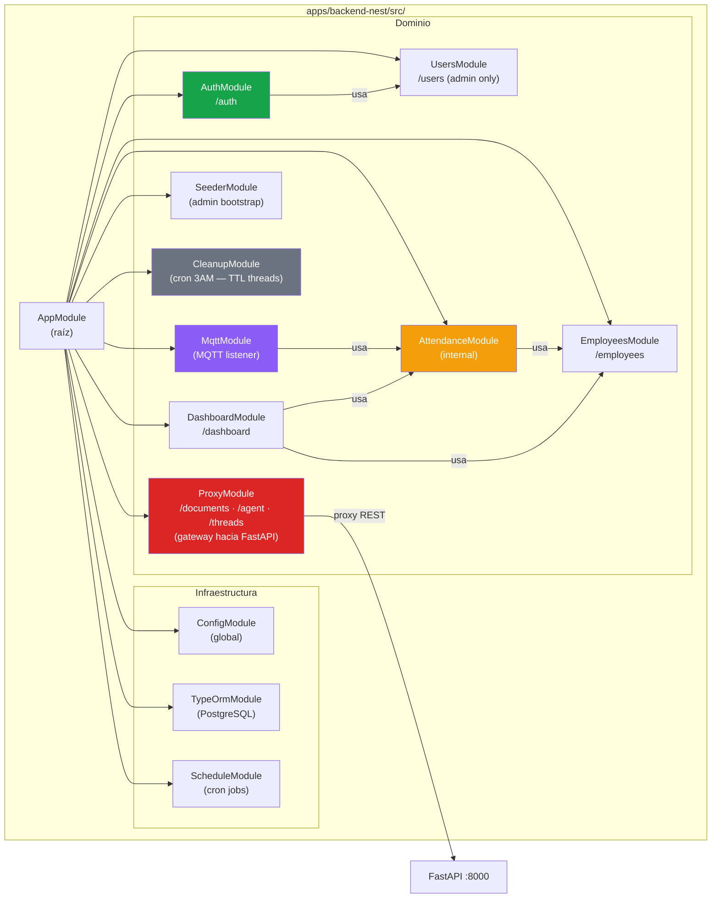
```mermaid
graph LR
    subgraph "apps/backend-nest/src/"
        AM["AppModule\n(raíz)"]

        subgraph "Infraestructura"
            CONFIG["ConfigModule\n(global)"]
            TYPEORM["TypeOrmModule\n(PostgreSQL)"]
            SCHED["ScheduleModule\n(cron jobs)"]
        end

        subgraph "Dominio"
            AUTH["AuthModule\n/auth"]
            USERS["UsersModule\n/users (admin only)"]
            EMP["EmployeesModule\n/employees"]
            ATT["AttendanceModule\n(internal)"]
            DASH["DashboardModule\n/dashboard"]
            MQ["MqttModule\n(MQTT listener)"]
            PROXY["ProxyModule\n/documents · /agent · /threads\n(gateway hacia FastAPI)"]
            SEED["SeederModule\n(admin bootstrap)"]
            CLEAN["CleanupModule\n(cron 3AM — TTL threads)"]
        end
    end

    AM --> CONFIG
    AM --> TYPEORM
    AM --> SCHED
    AM --> AUTH
    AM --> USERS
    AM --> EMP
    AM --> ATT
    AM --> DASH
    AM --> MQ
    AM --> PROXY
    AM --> SEED
    AM --> CLEAN

    AUTH -->|"usa"| USERS
    MQ -->|"usa"| ATT
    ATT -->|"usa"| EMP
    DASH -->|"usa"| ATT
    DASH -->|"usa"| EMP
    PROXY -->|"proxy REST"| FAPI_REF["FastAPI :8000"]

    style AUTH fill:#16a34a,color:#fff
    style MQ fill:#8b5cf6,color:#fff
    style ATT fill:#f59e0b,color:#fff
    style PROXY fill:#dc2626,color:#fff
    style CLEAN fill:#6b7280,color:#fff
```

### Endpoints expuestos

| Método | Ruta | Guard | Descripción |
|--------|------|-------|-------------|
| `POST` | `/auth/login` | Público | Retorna JWT |
| `GET` | `/auth/me` | JWT | Usuario autenticado |
| `POST` | `/auth/logout` | JWT | Cierra sesión |
| `GET` | `/employees` | JWT | Lista paginada con filtros |
| `GET` | `/employees/:id` | JWT | Detalle de empleado |
| `POST` | `/employees` | JWT | Crear empleado |
| `PUT` | `/employees/:id` | JWT | Editar empleado |
| `DELETE` | `/employees/:id` | JWT | Dar de baja (→ INACTIVO) |
| `GET` | `/dashboard/today` | JWT | Asistencia del día |
| `GET` | `/dashboard/monthly-average` | JWT | Promedio mensual |
| `GET` | `/dashboard/recent-entries` | JWT | Últimas entradas del día actual |
| `GET` | `/dashboard/tardiness` | JWT | Reporte de tardanzas |
| `GET` | `/dashboard/monthly-absences` | JWT | Reporte de ausencias del mes |
| `GET` | `/users` | JWT + admin | Lista usuarios RRHH |
| `GET` | `/users/:id` | JWT + admin | Detalle de usuario |
| `POST` | `/users` | JWT + admin | Crea usuario RRHH (el admin único se crea por seeder, no por este endpoint) |
| `PATCH` | `/users/:id` | JWT + admin | Edita email/password/is_active |
| `PATCH` | `/users/:id/deactivate` | JWT + admin | Desactiva usuario |

Además, `ProxyModule` reenvía con guard JWT (sin chequeo de rol) las rutas
`/documents/*`, `/agent/*` y `/threads/*` hacia FastAPI — ver
[docs/api/nest-endpoints.md](docs/api/nest-endpoints.md) y la tabla de
endpoints FastAPI más abajo.

### Lógica de asistencia (AttendanceService)

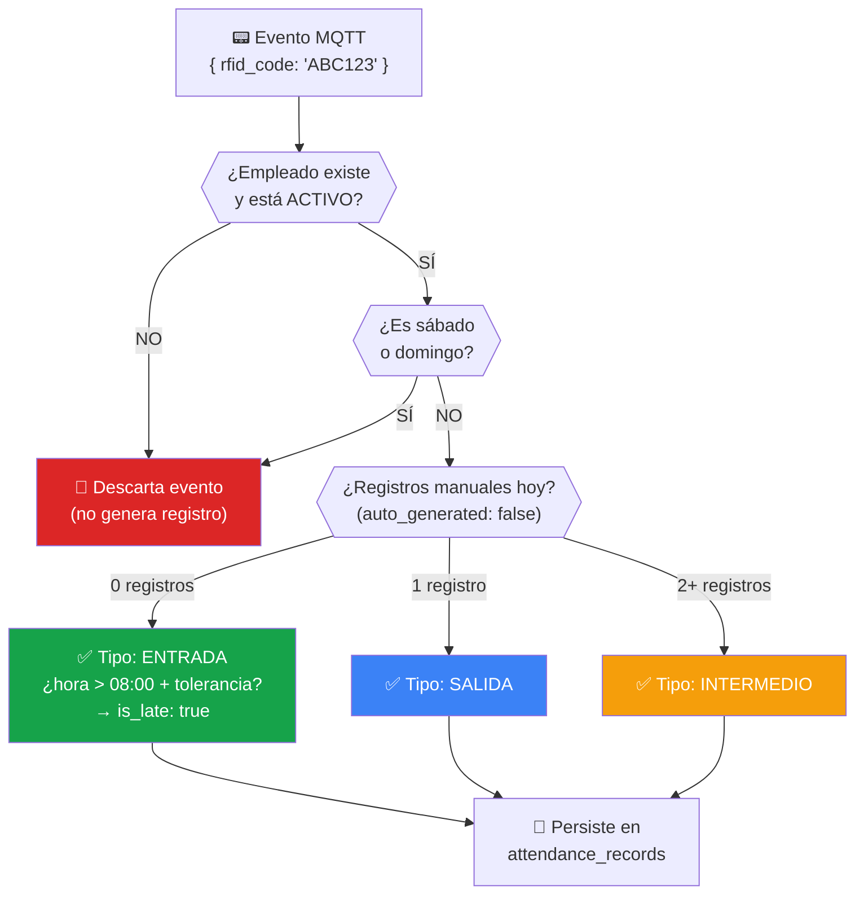
```mermaid
flowchart TD
    RFID["📟 Evento MQTT\n{ rfid_code: 'ABC123' }"]
    CHECK_EMP{{"¿Empleado existe\ny está ACTIVO?"}}
    DISCARD["🚫 Descarta evento\n(no genera registro)"]
    CHECK_WEEKEND{{"¿Es sábado\no domingo?"}}
    COUNT{{"¿Registros manuales hoy?\n(auto_generated: false)"}}
    ENTRADA["✅ Tipo: ENTRADA\n¿hora > 08:00 + tolerancia?\n→ is_late: true"]
    SALIDA["✅ Tipo: SALIDA"]
    INTER["✅ Tipo: INTERMEDIO"]
    SAVE["💾 Persiste en\nattendance_records"]

    RFID --> CHECK_EMP
    CHECK_EMP -->|"NO"| DISCARD
    CHECK_EMP -->|"SÍ"| CHECK_WEEKEND
    CHECK_WEEKEND -->|"SÍ"| DISCARD
    CHECK_WEEKEND -->|"NO"| COUNT
    COUNT -->|"0 registros"| ENTRADA
    COUNT -->|"1 registro"| SALIDA
    COUNT -->|"2+ registros"| INTER
    ENTRADA --> SAVE
    SALIDA --> SAVE
    INTER --> SAVE

    style ENTRADA fill:#16a34a,color:#fff
    style SALIDA fill:#3b82f6,color:#fff
    style INTER fill:#f59e0b,color:#fff
    style DISCARD fill:#dc2626,color:#fff
```

**Tardanza:** el corte es `WORKDAY_START_HOUR:WORKDAY_START_MINUTE` (08:00, hardcodeado en el código) + `LATE_TOLERANCE_MINUTES` (variable de entorno, `.env.example` la fija en `5`) → **08:05** con la configuración actual del repo, pero cambia si se modifica esa variable. La comparación es estrictamente `>` (mayor, no mayor-o-igual).

**Conteo de registros del día:** el conteo que decide ENTRADA/SALIDA/INTERMEDIO excluye los registros con `auto_generated: true` — si el cron de las 16:00 ya generó una salida automática, no cuenta para clasificar un fichaje manual posterior del mismo día.

**Fin de semana:** cualquier evento RFID recibido un sábado o domingo se descarta sin generar ningún registro, aunque el empleado exista y esté activo (mismo resultado visual que "empleado no encontrado", pero por un motivo distinto).

**Cron job — Salida automática (16:00, lun-vie):**  
Para cada empleado activo con ENTRADA registrada pero sin SALIDA, se genera automáticamente un registro con `auto_generated: true`.

### Entidades TypeORM

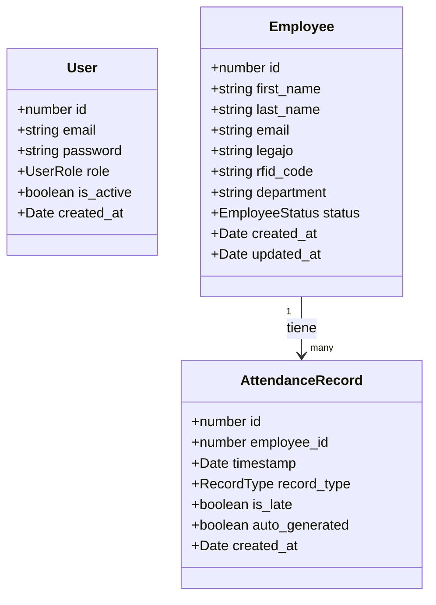
```mermaid
classDiagram
    class User {
        +number id
        +string email
        +string password
        +UserRole role
        +boolean is_active
        +Date created_at
    }
    class Employee {
        +number id
        +string first_name
        +string last_name
        +string email
        +string legajo
        +string rfid_code
        +string department
        +EmployeeStatus status
        +Date created_at
        +Date updated_at
    }
    class AttendanceRecord {
        +number id
        +number employee_id
        +Date timestamp
        +RecordType record_type
        +boolean is_late
        +boolean auto_generated
        +Date created_at
    }

    Employee "1" --> "many" AttendanceRecord : tiene
```

---

## 4. Fase 3 — Backend FastAPI + Agente RAG

> **Límite de confianza:** FastAPI **no implementa autenticación propia** — no valida JWT ni ningún otro mecanismo en sus endpoints. Confía por completo en que solo NestJS le habla (ver `ProxyModule`, sección 3), que ya aplicó `JwtAuthGuard` antes de reenviar la request. Esto significa que el puerto `:8000` **no debe exponerse** fuera de la red interna de Docker en ningún despliegue — si se expone, cualquiera puede pegarle directo a `/agent/chat` o `/documents/*` sin login.

### Diagrama de módulos

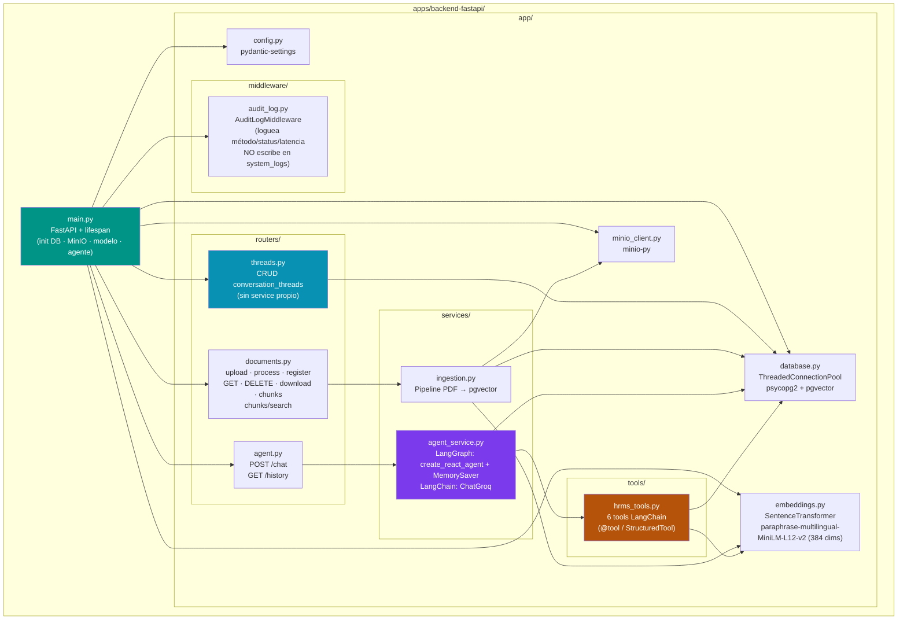
```mermaid
graph TB
    subgraph "apps/backend-fastapi/"
        MAIN["main.py\nFastAPI + lifespan\n(init DB · MinIO · modelo · agente)"]

        subgraph "app/"
            CONFIG2["config.py\npydantic-settings"]
            DB["database.py\nThreadedConnectionPool\npsycopg2 + pgvector"]
            MINIO2["minio_client.py\nminio-py"]
            EMB["embeddings.py\nSentenceTransformer\nparaphrase-multilingual-MiniLM-L12-v2 (384 dims)"]

            subgraph "routers/"
                R_DOCS["documents.py\nupload · process · register\nGET · DELETE · download · chunks\nchunks/search"]
                R_AGENT["agent.py\nPOST /chat\nGET /history"]
                R_THREADS["threads.py\nCRUD conversation_threads\n(sin service propio)"]
            end

            subgraph "middleware/"
                MW_AUDIT["audit_log.py\nAuditLogMiddleware\n(loguea método/status/latencia\nNO escribe en system_logs)"]
            end

            subgraph "services/"
                S_ING["ingestion.py\nPipeline PDF → pgvector"]
                S_AGT["agent_service.py\nLangGraph: create_react_agent + MemorySaver\nLangChain: ChatGroq"]
            end

            subgraph "tools/"
                TOOLS["hrms_tools.py\n6 tools LangChain\n(@tool / StructuredTool)"]
            end
        end
    end

    MAIN --> CONFIG2
    MAIN --> DB
    MAIN --> MINIO2
    MAIN --> EMB
    MAIN --> MW_AUDIT
    MAIN --> R_DOCS
    MAIN --> R_AGENT
    MAIN --> R_THREADS

    R_DOCS --> S_ING
    R_AGENT --> S_AGT
    R_THREADS --> DB
    S_ING --> DB
    S_ING --> MINIO2
    S_ING --> EMB
    S_AGT --> TOOLS
    S_AGT --> DB
    TOOLS --> DB
    TOOLS --> EMB

    style MAIN fill:#009486,color:#fff
    style S_AGT fill:#7c3aed,color:#fff
    style TOOLS fill:#b45309,color:#fff
    style R_THREADS fill:#0891b2,color:#fff
```

### Pipeline de ingestión de documentos

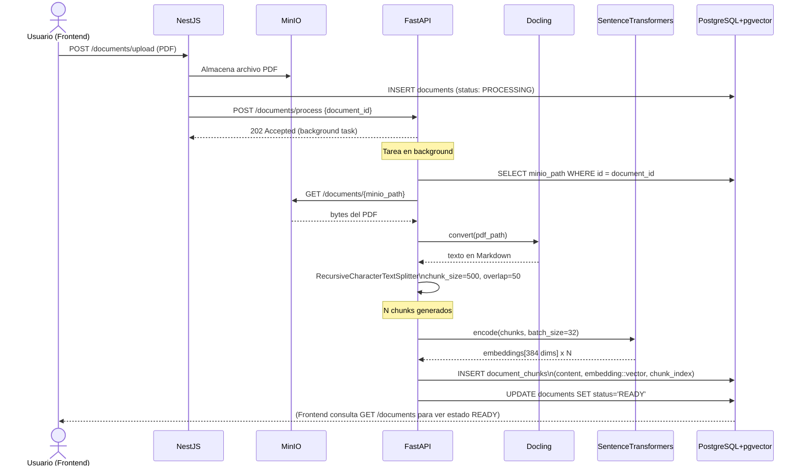
```mermaid
sequenceDiagram
    actor U as Usuario (Frontend)
    participant N as NestJS
    participant M as MinIO
    participant F as FastAPI
    participant D as Docling
    participant S as SentenceTransformers
    participant PG as PostgreSQL+pgvector

    U->>N: POST /documents/upload (PDF)
    N->>M: Almacena archivo PDF
    N->>PG: INSERT documents (status: PROCESSING)
    N->>F: POST /documents/process {document_id}
    F-->>N: 202 Accepted (background task)

    Note over F: Tarea en background

    F->>PG: SELECT minio_path WHERE id = document_id
    F->>M: GET /documents/{minio_path}
    M-->>F: bytes del PDF

    F->>D: convert(pdf_path)
    D-->>F: texto en Markdown

    F->>F: RecursiveCharacterTextSplitter\nchunk_size=500, overlap=50
    Note over F: N chunks generados

    F->>S: encode(chunks, batch_size=32)
    S-->>F: embeddings[384 dims] x N

    F->>PG: INSERT document_chunks\n(content, embedding::vector, chunk_index)
    F->>PG: UPDATE documents SET status='READY'

    PG-->>U: (Frontend consulta GET /documents para ver estado READY)
```

### Flujo del agente RAG

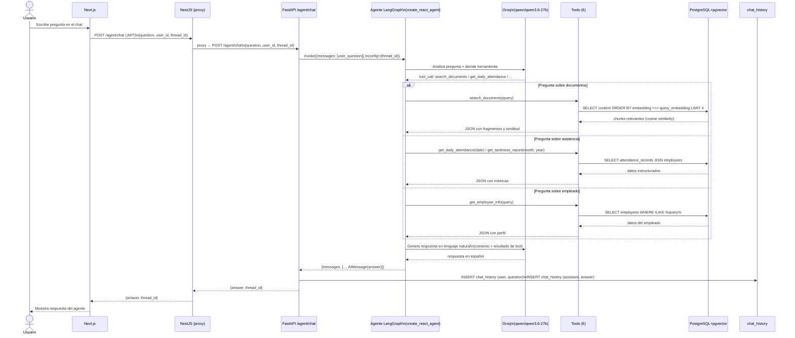
```mermaid
sequenceDiagram
    actor U as Usuario
    participant FE as Next.js
    participant N as NestJS (proxy)
    participant FA as FastAPI /agent/chat
    participant AG as Agente LangGraph\n(create_react_agent)
    participant LLM as Groq\n(qwen/qwen3.6-27b)
    participant T as Tools (6)
    participant PG as PostgreSQL+pgvector
    participant DB as chat_history

    U->>FE: Escribe pregunta en el chat
    FE->>N: POST /agent/chat (JWT)\n{question, user_id, thread_id}
    N->>FA: proxy → POST /agent/chat\n{question, user_id, thread_id}

    FA->>AG: invoke({messages: [user_question]},\nconfig={thread_id})

    AG->>LLM: Analiza pregunta + decide herramienta
    LLM-->>AG: tool_call: search_documents / get_daily_attendance / ...

    alt Pregunta sobre documentos
        AG->>T: search_documents(query)
        T->>PG: SELECT content ORDER BY embedding <=> query_embedding LIMIT 4
        PG-->>T: chunks relevantes (cosine similarity)
        T-->>AG: JSON con fragmentos y similitud
    else Pregunta sobre asistencia
        AG->>T: get_daily_attendance(date) / get_tardiness_report(month, year)
        T->>PG: SELECT attendance_records JOIN employees
        PG-->>T: datos estructurados
        T-->>AG: JSON con métricas
    else Pregunta sobre empleado
        AG->>T: get_employee_info(query)
        T->>PG: SELECT employees WHERE ILIKE %query%
        PG-->>T: datos del empleado
        T-->>AG: JSON con perfil
    end

    AG->>LLM: Genera respuesta en lenguaje natural\n(contexto + resultado de tool)
    LLM-->>AG: respuesta en español

    AG-->>FA: {messages: [..., AIMessage(answer)]}
    FA->>DB: INSERT chat_history (user, question)\nINSERT chat_history (assistant, answer)
    FA-->>N: {answer, thread_id}
    N-->>FE: {answer, thread_id}
    FE-->>U: Muestra respuesta del agente
```

### Herramientas del agente (6 tools LangChain)

| Herramienta | Descripción | Fuente de datos |
|---|---|---|
| `search_documents` | Búsqueda semántica en documentos empresariales | pgvector (cosine similarity) |
| `get_daily_attendance` | Asistencia del día: presentes, ausentes, tardanzas | `attendance_records` |
| `get_employee_attendance` | Resumen mensual de un empleado | `attendance_records` |
| `get_tardiness_report` | Empleados con tardanzas en el mes | `attendance_records` |
| `get_monthly_summary` | Estadísticas generales del mes | `attendance_records` |
| `get_employee_info` | Búsqueda de empleado por nombre/legajo | `employees` |

### Endpoints FastAPI

| Método | Ruta | Descripción |
|--------|------|-------------|
| `POST` | `/documents/upload` | Sube PDF a MinIO + registra documento (entry point real desde el frontend) |
| `POST` | `/documents/register` | Registra documento (status: PROCESSING) |
| `POST` | `/documents/process` | Lanza pipeline ingestión en background |
| `GET` | `/documents/` | Lista todos los documentos |
| `GET` | `/documents/:id` | Detalle de documento |
| `GET` | `/documents/:id/download` | Descarga el PDF original (para el visor en frontend) |
| `GET` | `/documents/:id/chunks` | Lista los chunks generados de un documento |
| `POST` | `/documents/chunks/search` | Búsqueda semántica manual sobre chunks (panel admin) |
| `DELETE` | `/documents/:id` | Elimina documento y sus chunks |
| `POST` | `/agent/chat` | Consulta al agente RAG |
| `GET` | `/agent/history/:user_id` | Historial de conversación (filtrable por `thread_id`) |
| `POST` | `/threads/` | Crea un hilo de conversación |
| `GET` | `/threads/:user_id` | Lista los hilos de un usuario |
| `PATCH` | `/threads/:thread_id/rename` | Renombra un hilo |
| `DELETE` | `/threads/:thread_id` | Elimina un hilo |
| `GET` | `/health` | Health check |

### Hilos de conversación y logs de sistema (Sprints 2/3)

> **"Sprint" vs. "Fase":** las Fases 1-5 de este documento son las etapas de construcción inicial del MVP (cada una con su doc en `docs/phases/`). Los "Sprints" son trabajo posterior, ya sobre el sistema funcionando, priorizado desde `docs/ideas-plan.md` — no reemplazan ni continúan la numeración de fases, son una unidad de planificación distinta aplicada después de que las 5 fases ya estaban integradas a `master`.

Agregado después de la fase 3 inicial (commits `68a2952`, `23a1ba1`,
`89168d1`, `15617ba` — 2026-06-16), no cubierto por los docs de fase
originales:

**Hilos múltiples (`conversation_threads`):** antes de este cambio, cada
usuario tenía un único thread implícito (`user-{user_id}`) para memoria del
agente. Ahora el frontend puede crear varios hilos por usuario (panel
lateral en la página de chat), cada uno con su propio historial en
`chat_history.thread_id`. Un cron (`CleanupService`, `@Cron(EVERY_DAY_AT_3AM)`
en `apps/backend-nest/src/cleanup/cleanup.service.ts`) borra los hilos con
`last_message_at` de más de 30 días (valor hardcodeado, no configurable por
env var).

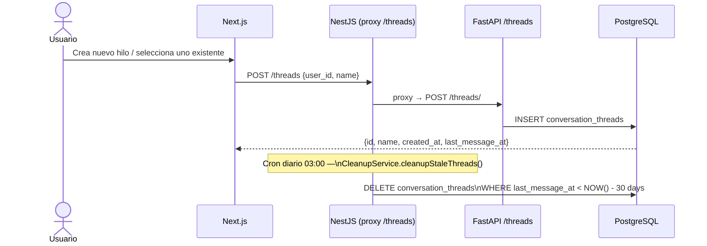
```mermaid
sequenceDiagram
    actor U as Usuario
    participant FE as Next.js
    participant N as NestJS (proxy /threads)
    participant FA as FastAPI /threads
    participant PG as PostgreSQL

    U->>FE: Crea nuevo hilo / selecciona uno existente
    FE->>N: POST /threads {user_id, name}
    N->>FA: proxy → POST /threads/
    FA->>PG: INSERT conversation_threads
    PG-->>FE: {id, name, created_at, last_message_at}

    Note over N: Cron diario 03:00 —\nCleanupService.cleanupStaleThreads()
    N->>PG: DELETE conversation_threads\nWHERE last_message_at < NOW() - 30 days
```

**Logs de sistema (`system_logs`):** la migración `003_system_logs.sql`
agregó esta tabla para auditoría (`level`, `service`, `event`, `detail
JSONB`). En la práctica, **hoy nada la escribe**: `AuditLogMiddleware`
(FastAPI, `app/middleware/audit_log.py`) y `LoggingInterceptor` (NestJS,
`src/logging/logging.interceptor.ts`) solo loguean método/ruta/status/latencia
al logger de cada proceso (stdout / archivo), no insertan filas en la tabla.
Es un gap entre lo que sugiere el nombre del commit ("persistidos en la
tabla system_logs") y el código real — vale la pena revisarlo si se necesita
auditoría persistente real.

---

## 5. Fase 4 — Frontend Next.js

### Stack

| Tecnología | Versión | Rol |
|---|---|---|
| Next.js | 16.2.6 | Framework React con App Router |
| React | 19.2.4 | UI library |
| TypeScript | 5.x | Tipado estático |
| Tailwind CSS | 4.x | Utility-first CSS |
| shadcn/ui + @base-ui/react | — | Componentes accesibles (`@base-ui/react` en vez de Radix: sin `asChild`, se compone con `render={<Button />}`) |
| recharts | 3.10.x | Donut chart de asistencia del día en el dashboard |
| react-markdown + remark-gfm | 10.1.x / 4.0.x | Renderizado de Markdown (GFM) en las respuestas del chat |

### Estructura de rutas (App Router)

```
apps/frontend/
├── proxy.ts                        # Protección de rutas (reemplaza middleware.ts en Next.js 16)
├── app/
│   ├── login/page.tsx               # Formulario de login
│   └── (dashboard)/
│       ├── dashboard/page.tsx       # KPIs y tablas de asistencia
│       ├── employees/page.tsx       # CRUD empleados con paginación
│       ├── documents/page.tsx       # Upload y gestión de PDFs
│       └── chat/page.tsx            # Interfaz de chat con agente RAG
├── components/                      # layout/ (sidebar, header) + ui/ (shadcn/ui)
└── lib/
    ├── api.ts                       # Cliente API tipado — todas las rutas vía NestJS
    └── auth.ts                      # Sesión: cookie + localStorage
```

### Sesión: cookie + localStorage, no uno solo

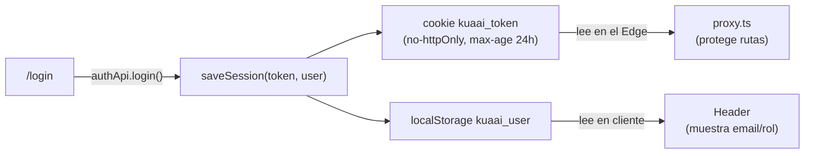
```mermaid
flowchart LR
    LOGIN["/login"] -->|"authApi.login()"| SAVE["saveSession(token, user)"]
    SAVE --> COOKIE["cookie kuaai_token\n(no-httpOnly, max-age 24h)"]
    SAVE --> LS["localStorage kuaai_user"]
    COOKIE -->|"lee en el Edge"| PROXY["proxy.ts\n(protege rutas)"]
    LS -->|"lee en cliente"| HEADER["Header\n(muestra email/rol)"]
```

- **Cookie `kuaai_token`** (no-httpOnly): la lee `proxy.ts` en el Edge para redirigir si falta el token, y `lib/auth.ts` en cliente para adjuntar el `Authorization: Bearer`.
- **localStorage `kuaai_user`**: guarda `{ id, email, role }` para que los componentes muestren usuario/rol sin pegarle a `/auth/me` en cada render.

Next.js 16 renombró `middleware.ts` a `proxy.ts` (misma semántica: corre en el Edge antes del render). **No confundir** este `proxy.ts` del frontend con el `ProxyModule` de NestJS (sección 3) — son dos capas de proxy distintas y sin relación entre sí: una protege rutas del lado del cliente, la otra hace de API gateway del lado del servidor.

### Páginas principales

| Ruta | Contenido |
|---|---|
| `/login` | Formulario de autenticación |
| `/dashboard` | KPIs (asistencia del día, promedio mensual, tardanzas recurrentes) + tablas en tiempo real (polling 20s) |
| `/employees` | CRUD paginado con búsqueda y filtro por departamento |
| `/documents` | Upload de PDFs, stepper de progreso del pipeline RAG, polling cada 3s mientras hay documentos `PROCESSING` |
| `/chat` | Chat con el agente RAG, historial por thread, indicador de "Pensando..." |

Todas las páginas llaman **exclusivamente** a NestJS (`lib/api.ts`) — nunca a FastAPI directamente, consistente con el patrón de proxy de la sección 1. `lib/api.ts` además parsea tanto `body.message` (formato de error de NestJS) como `body.detail` (formato de error de FastAPI) para mostrar mensajes descriptivos en vez de "Error 500" genérico.

Detalle completo (todas las páginas, componentes y decisiones de UI): `docs/phases/phase-4-frontend.md`.

---

## 6. Fase 5 — Nodo IoT (Raspberry Pi Pico 2W)

### Hardware

| Componente | Modelo |
|---|---|
| Microcontrolador | Raspberry Pi Pico 2W |
| Lector RFID | RC522 (interfaz SPI) |
| Feedback visual | 4 LEDs — GP8 (conexión OK), GP9 (sin conexión), GP12 (lectura OK), GP13 (error de publish) |
| Feedback sonoro | Buzzer pasivo (GP15) |

### Estructura de archivos

```
apps/iot-node/
├── boot.py              # Habilita GC; corre antes de main.py
├── main.py              # Firmware principal (asyncio)
├── mfrc522.py           # Driver SPI del lector RC522 (vendorizado)
├── mqtt_as.py           # Cliente MQTT asíncrono con reconexión automática (vendorizado)
├── secrets.py           # Credenciales WiFi/MQTT (no versionado)
└── secrets.example.py   # Plantilla para versionar
```

### Flujo del firmware

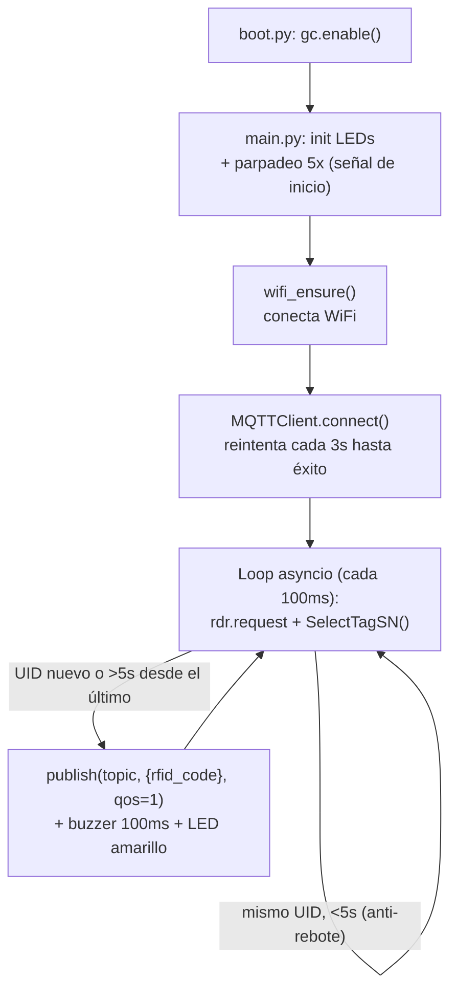
```mermaid
flowchart TD
    BOOT["boot.py: gc.enable()"] --> INIT["main.py: init LEDs\n+ parpadeo 5x (señal de inicio)"]
    INIT --> WIFI["wifi_ensure()\nconecta WiFi"]
    WIFI --> MQTTCONN["MQTTClient.connect()\nreintenta cada 3s hasta éxito"]
    MQTTCONN --> LOOP["Loop asyncio (cada 100ms):\nrdr.request + SelectTagSN()"]
    LOOP -->|"UID nuevo o >5s desde el último"| PUBLISH["publish(topic, {rfid_code}, qos=1)\n+ buzzer 100ms + LED amarillo"]
    LOOP -->|"mismo UID, <5s (anti-rebote)"| LOOP
    PUBLISH --> LOOP
```

`rfid_code` se envía siempre como **string**, no como entero: el UID que devuelve el RC522 es una lista de bytes que el firmware convierte con `int.from_bytes()` y luego `str()`, porque `employees.rfid_code` en PostgreSQL es `VARCHAR(100)`.

### Por qué `mqtt_as` y no `umqtt.simple`

`umqtt.simple` (el cliente MQTT que trae MicroPython por defecto) no reconecta solo. `mqtt_as` es asíncrono (`uasyncio`), reconecta automáticamente ante cortes de WiFi o del broker, y soporta QoS 1 — necesario para no perder fichajes.

> **Limitación conocida (no resuelta a propósito):** `MQTTClient.publish()` de `mqtt_as` reintenta un `OSError` de red **indefinidamente y en silencio** — nunca propaga la excepción a `main.py`. Como el firmware hace `await enviar_mensaje(...)` dentro del mismo loop que lee tarjetas, mientras un publish queda colgado reintentando, **el lector no lee tarjetas nuevas** (no se pierden ni se encolan: el hardware queda "sordo" durante el corte). No existe cola de reintento. Para el estado actual del MVP (WiFi local, cortes breves y poco frecuentes) se decidió no construirla todavía — ver `docs/phases/phase-5-iot.md` para el detalle completo y las dos alternativas evaluadas para cuando haga falta más robustez.

---

## 7. Modelo de datos

### Diagrama entidad-relación

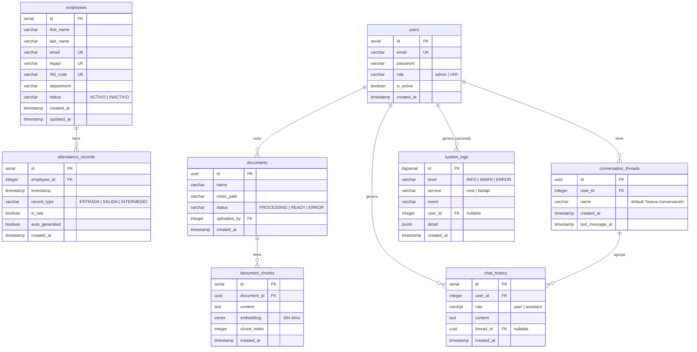
```mermaid
erDiagram
    users {
        serial id PK
        varchar email UK
        varchar password
        varchar role "admin | rrhh"
        boolean is_active
        timestamp created_at
    }

    employees {
        serial id PK
        varchar first_name
        varchar last_name
        varchar email UK
        varchar legajo UK
        varchar rfid_code UK
        varchar department
        varchar status "ACTIVO | INACTIVO"
        timestamp created_at
        timestamp updated_at
    }

    attendance_records {
        serial id PK
        integer employee_id FK
        timestamp timestamp
        varchar record_type "ENTRADA | SALIDA | INTERMEDIO"
        boolean is_late
        boolean auto_generated
        timestamp created_at
    }

    documents {
        uuid id PK
        varchar name
        varchar minio_path
        varchar status "PROCESSING | READY | ERROR"
        integer uploaded_by FK
        timestamp created_at
    }

    document_chunks {
        serial id PK
        uuid document_id FK
        text content
        vector embedding "384 dims"
        integer chunk_index
        timestamp created_at
    }

    chat_history {
        serial id PK
        integer user_id FK
        varchar role "user | assistant"
        text content
        uuid thread_id FK "nullable"
        timestamp created_at
    }

    conversation_threads {
        uuid id PK
        integer user_id FK
        varchar name "default 'Nueva conversación'"
        timestamp created_at
        timestamp last_message_at
    }

    system_logs {
        bigserial id PK
        varchar level "INFO | WARN | ERROR"
        varchar service "nest | fastapi"
        varchar event
        integer user_id FK "nullable"
        jsonb detail
        timestamp created_at
    }

    employees ||--o{ attendance_records : "tiene"
    users ||--o{ documents : "sube"
    documents ||--o{ document_chunks : "tiene"
    users ||--o{ chat_history : "genera"
    users ||--o{ conversation_threads : "tiene"
    conversation_threads ||--o{ chat_history : "agrupa"
    users ||--o{ system_logs : "genera (opcional)"
```

> **Nota:** `system_logs` (migración `003_system_logs.sql`) existe en el
> esquema pero **hoy no la escribe ningún código** — ni
> `AuditLogMiddleware` (FastAPI) ni `LoggingInterceptor` (NestJS) insertan
> ahí; ambos solo loguean a stdout/archivo. Ver la sección de threads y
> logs de sistema más abajo.

---

## 8. Flujos de operación críticos

### Flujo 1 — Login y autenticación

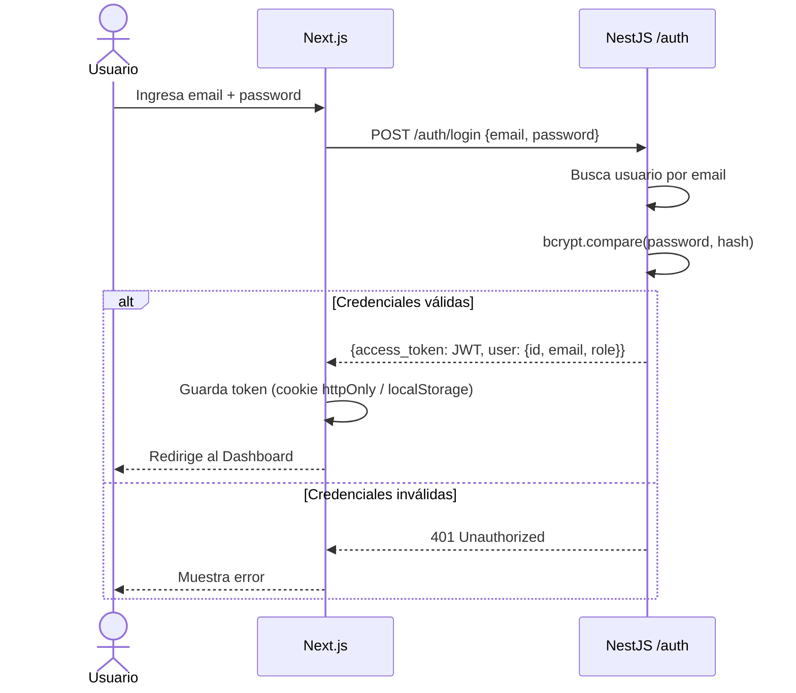
```mermaid
sequenceDiagram
    actor U as Usuario
    participant FE as Next.js
    participant N as NestJS /auth

    U->>FE: Ingresa email + password
    FE->>N: POST /auth/login {email, password}
    N->>N: Busca usuario por email
    N->>N: bcrypt.compare(password, hash)
    alt Credenciales válidas
        N-->>FE: {access_token: JWT, user: {id, email, role}}
        FE->>FE: Guarda token (cookie httpOnly / localStorage)
        FE-->>U: Redirige al Dashboard
    else Credenciales inválidas
        N-->>FE: 401 Unauthorized
        FE-->>U: Muestra error
    end
```

### Flujo 2 — Registro RFID IoT

Este diagrama muestra el camino de punta a punta entre los 4 componentes (hardware → broker → NestJS → DB). El detalle completo de la clasificación ENTRADA/SALIDA/INTERMEDIO, el cálculo de tardanza y los criterios de descarte (fin de semana, empleado inexistente/inactivo) está documentado **una sola vez**, en "[Lógica de asistencia (AttendanceService)](#lógica-de-asistencia-attendanceservice)" — sección 3 — para evitar que ambos diagramas queden desincronizados entre sí.

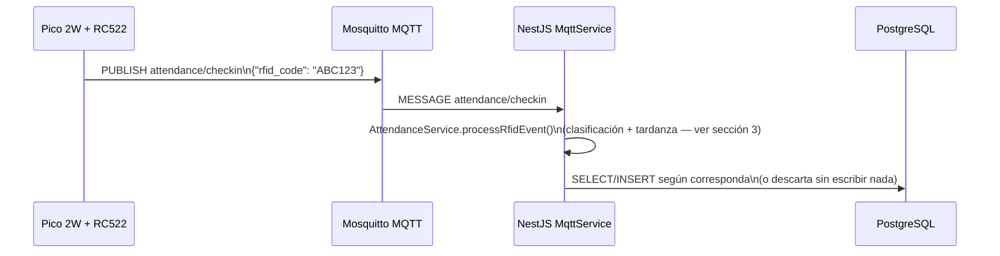
```mermaid
sequenceDiagram
    participant HW as Pico 2W + RC522
    participant MQ as Mosquitto MQTT
    participant N as NestJS MqttService
    participant DB as PostgreSQL

    HW->>MQ: PUBLISH attendance/checkin\n{"rfid_code": "ABC123"}
    MQ->>N: MESSAGE attendance/checkin
    N->>N: AttendanceService.processRfidEvent()\n(clasificación + tardanza — ver sección 3)
    N->>DB: SELECT/INSERT según corresponda\n(o descarta sin escribir nada)
```

---

## 9. Seguridad

Resumen de los mecanismos de autenticación, autorización, manejo de credenciales
y endurecimiento de transporte del sistema. Estado **MVP**: varios controles
están implementados, otros se difirieron a propósito y están listados en
[Gaps conocidos](#gaps-conocidos-pendientes). Cada dato apunta al archivo donde
vive la implementación real.

### Capas que atraviesa una request

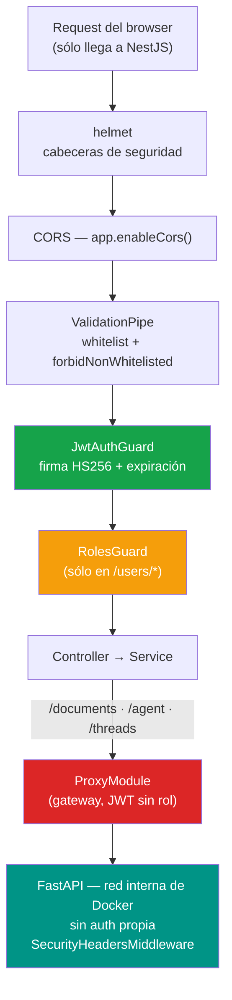
```mermaid
flowchart TD
    REQ["Request del browser\n(sólo llega a NestJS)"] --> HELMET["helmet\ncabeceras de seguridad"]
    HELMET --> CORSL["CORS — app.enableCors()"]
    CORSL --> VP["ValidationPipe\nwhitelist + forbidNonWhitelisted"]
    VP --> JWTG["JwtAuthGuard\nfirma HS256 + expiración"]
    JWTG --> ROLES["RolesGuard\n(sólo en /users/*)"]
    ROLES --> CTRL["Controller → Service"]
    CTRL -->|"/documents · /agent · /threads"| PROXY["ProxyModule\n(gateway, JWT sin rol)"]
    PROXY --> FAPI["FastAPI — red interna de Docker\nsin auth propia\nSecurityHeadersMiddleware"]

    style JWTG fill:#16a34a,color:#fff
    style ROLES fill:#f59e0b,color:#fff
    style PROXY fill:#dc2626,color:#fff
    style FAPI fill:#009486,color:#fff
```

### Autenticación (JWT)

| Aspecto | Implementación |
|---|---|
| Librerías | `@nestjs/jwt` (wrapper de `jsonwebtoken`) + `@nestjs/passport` + `passport-jwt` |
| Algoritmo | **HS256** — default de `jsonwebtoken`; no se setea `algorithm` explícito |
| Firma / verificación | `JwtModule.registerAsync` en `auth.module.ts` — `secret: config.get('JWT_SECRET')` |
| Expiración | `JWT_EXPIRATION` (`.env`), default `'24h'` si no está seteada |
| Payload | `{ sub: user.id, email, role }` (`auth.service.ts`) |
| Fuente del token en requests | `jwt.strategy.ts` acepta **dos**: header `Authorization: Bearer <t>` y query param `?token=<t>` |
| Chequeo de expiración | `ignoreExpiration: false` |
| Protección de rutas | `JwtAuthGuard extends AuthGuard('jwt')` declarado por controller; expone `req.user = { id, email, role }` desde `JwtStrategy.validate()` |

**`JWT_SECRET`:** requerido y **sin fallback en código** — si falta, la app arranca
igual (no hay validación al bootstrap, ver
[Carga de variables de entorno](#carga-y-validación-de-variables-de-entorno)) y
los tokens se firman con `undefined`. `.env.example` trae el placeholder genérico
`your_jwt_secret_here`; en cualquier despliegue debe reemplazarse en `.env` por un
valor aleatorio largo (≥ 32 bytes, base64/hex). El `.env` de desarrollo local usa
un secreto aleatorio de 48 bytes distinto del placeholder público.

### Autorización (guards y roles)

- **`RolesGuard` + `@Roles(...)`** (`SetMetadata('roles', ...)`) — chequea
  `required.includes(user.role)`.
- **Único controller con control de rol:** `UsersController` (`@Roles('admin')`),
  cubre todo `/users/*`. Empleados, dashboard, documentos, agente y threads sólo
  exigen JWT válido — **no distinguen `admin` de `rrhh`**.
- `ProxyModule` (`/documents/*`, `/agent/*`, `/threads/*`) reenvía a FastAPI
  detrás de `JwtAuthGuard`, sin chequeo de rol.
- Roles definidos: `admin` | `rrhh` (constraint `CHECK` en `users.role`).

### Contraseñas

| Aspecto | Implementación |
|---|---|
| Algoritmo | `bcrypt` (npm `bcrypt`, binding nativo — no `bcryptjs`) |
| Cost factor | `10`, hardcodeado (`bcrypt.hash(password, 10)`) |
| Dónde se hashea | `users.service.ts` — al crear usuario (`createUser`) y al cambiar contraseña (`updateUser`). Son los **dos únicos** puntos. |
| Verificación en login | `bcrypt.compare(plain, user.password)` en `auth.service.ts` |
| Admin inicial | `AdminSeeder` (`OnApplicationBootstrap`) crea el admin desde `ADMIN_EMAIL` / `ADMIN_PASSWORD` si no existe; si esas vars faltan, loguea warning y no crea nada (no rompe el arranque) |

No hay política de complejidad ni de rotación de contraseñas — fuera de alcance del MVP.

### Límite de confianza NestJS / FastAPI

FastAPI **no implementa autenticación propia**: ningún endpoint valida JWT ni
ningún otro mecanismo. El modelo de seguridad depende de que **sólo NestJS**
pueda alcanzarlo:

- `docker-compose.yml` **no publica** el puerto `8000` al host (mapeo `8000:8000`
  removido — commit `e336002`). FastAPI sólo es accesible dentro de la red interna
  de Docker, por nombre de servicio: `http://backend-fastapi:8000` (var `FASTAPI_URL`).
- NestJS le habla exclusivamente vía `ProxyModule`, después de aplicar `JwtAuthGuard`.
- `scripts/test-e2e.sh` verifica esta conectividad haciendo el health check de
  FastAPI **desde dentro del contenedor de NestJS**, no desde el host.

Un despliegue **nunca** debe volver a exponer `8000`. Si se hace, cualquiera en
esa red puede pegarle directo a `/agent/chat` o `/documents/*` sin login.

### Cabeceras de seguridad HTTP

**NestJS** — `app.use(helmet())` como primer middleware en `main.ts`. Emite los
defaults de helmet 8.x, verificados con `curl -I`:

`Content-Security-Policy` (`default-src 'self'` …), `Cross-Origin-Opener-Policy: same-origin`,
`Cross-Origin-Resource-Policy: same-origin`, `Origin-Agent-Cluster: ?1`,
`Referrer-Policy: no-referrer`, `Strict-Transport-Security: max-age=31536000; includeSubDomains`,
`X-Content-Type-Options: nosniff`, `X-DNS-Prefetch-Control: off`, `X-Download-Options: noopen`,
`X-Frame-Options: SAMEORIGIN`, `X-Permitted-Cross-Domain-Policies: none`, `X-XSS-Protection: 0`.

> `Strict-Transport-Security` lo emite helmet por default aunque dev sea HTTP; el
> navegador lo ignora sobre HTTP, así que es inofensivo hasta que haya TLS.

**FastAPI** — middleware propio `SecurityHeadersMiddleware`
(`app/middleware/security_headers.py`, mismo patrón `BaseHTTPMiddleware` que
`AuditLogMiddleware`, sin dependencias nuevas). Agrega a toda respuesta con
`setdefault` (no pisa cabeceras ya presentes):

| Cabecera | Valor |
|---|---|
| `X-Content-Type-Options` | `nosniff` |
| `X-Frame-Options` | `DENY` |
| `Referrer-Policy` | `strict-origin-when-cross-origin` |

Sin HSTS: el entorno de desarrollo corre sobre HTTP. Agregarla cuando haya
terminación TLS por delante.

### Carga y validación de variables de entorno

| Backend | Mecanismo | Validación al arrancar |
|---|---|---|
| NestJS | `@nestjs/config` — `ConfigModule.forRoot({ isGlobal: true })`, **sin** `validationSchema` (Joi) | **Ninguna.** Si falta una var (ej. `JWT_SECRET`), la app arranca y falla más tarde en runtime, o firma tokens con `undefined`. |
| FastAPI | `pydantic-settings` `BaseSettings`, `env_file=".env"`, `settings = Settings()` al importar el módulo | **Parcial.** `groq_api_key: str` no tiene default → `ValidationError` al importar si falta. El resto de las settings (credenciales de Postgres/MinIO, etc.) tienen defaults de desarrollo, así que su ausencia **no** se detecta. |

`.env` está en `.gitignore` (nunca se commitea). `.env.example` es la plantilla
versionada, con placeholders genéricos (`your_jwt_secret_here`, credenciales
`kuaai_*`) — quien clona el repo lo copia a `.env` y completa los valores reales.

### Otros mecanismos

| Mecanismo | Estado |
|---|---|
| Validación de input | NestJS: `ValidationPipe({ whitelist: true, forbidNonWhitelisted: true })` global + DTOs `class-validator`. FastAPI: modelos Pydantic en cada router. |
| Inyección SQL | Consultas parametrizadas en todos lados — TypeORM (params nombrados / query builder) en NestJS, psycopg2 con placeholders `%s` en FastAPI. No hay interpolación de strings dentro de SQL. |
| CORS | **Permisivo (MVP).** NestJS: `app.enableCors()` sin argumentos. FastAPI: `CORSMiddleware` con `allow_origins=["*"]`, `allow_methods=["*"]`, `allow_headers=["*"]`. En producción hay que restringir a los orígenes reales. |
| MQTT | `mosquitto.conf` con `allow_anonymous true`, sin TLS, puerto `1883` en claro. Aceptable en red local; endurecer para deploy. |
| Logging de requests | `LoggingInterceptor` (NestJS) y `AuditLogMiddleware` (FastAPI) loguean método/ruta/status/latencia a stdout/archivo. Ninguno escribe en `system_logs`. |

### Gaps conocidos (pendientes)

- **Sin rate limiting** — no hay `@nestjs/throttler` ni equivalente; `/auth/login`
  acepta intentos ilimitados.
- **JWT por query param** — `jwt.strategy.ts` acepta `?token=<jwt>` (lo usa el
  visor de PDF, `getDocumentDownloadUrl`). `LoggingInterceptor` loguea la URL
  completa → el token queda en los logs de NestJS.
- **Cookie de sesión** — `kuaai_token` se setea desde JS (`document.cookie`), sin
  `HttpOnly`, `Secure` ni `SameSite`.
- **CORS permisivo** en ambos backends (ver arriba).
- **Sin HTTPS/TLS** — todo el tráfico (browser ↔ NestJS, MQTT) va en claro; falta
  terminación TLS / reverse proxy para el deploy.
- **IDOR en el proxy** — los endpoints de `/threads/*` y `/agent/history/:user_id`
  reciben `user_id` en body/params y no lo contrastan contra el `sub` del JWT; un
  usuario autenticado podría leer hilos de otro.
- **`system_logs`** — tabla creada (migración `003_system_logs.sql`) pero ningún
  código la escribe; no hay auditoría persistente real.

---

## 10. Referencias

Este documento resume la arquitectura; el detalle de implementación y las decisiones puntuales viven en documentos aparte:

**Fases de construcción** (`docs/phases/`):
- `phase-1-infrastructure.md`, `phase-2-backend-nest.md`, `phase-3-backend-fastapi.md`, `phase-4-frontend.md`, `phase-5-iot.md` — detalle completo de cada fase resumida en las secciones 2-6 de este documento.
- `phase-6-integration.md` — seed de datos de prueba y scripts E2E, fuera del alcance de este documento (no es arquitectura).
- `phase-7-deploy-digitalocean-split.md` — reorganización del historial git; no describe un despliegue distinto al de `docker-compose.yml` (la guía de deploy en Digital Ocean vive aparte, en la rama `feature/deploy-digitalocean`, no mergeada a `master`).

**Decisiones de arquitectura** (`docs/decisions/`):
- `ADR-001-pgvector-vs-qdrant.md` — por qué pgvector como vector store en vez de un servicio separado.
- `ADR-002-nestjs-fastapi-split.md` — por qué dos backends (Node/Python) en vez de uno solo.
- `ADR-003-groq-vs-openai.md` y `ADR-004-groq-model-migration-qwen.md` — elección de proveedor LLM y migración de modelo (histórico: documentan Llama 3.1 8B como decisión original, superada por `qwen/qwen3.6-27b`).
- `ADR-005-chunk-size-embeddings-defaults.md` — por qué `chunk_size=500`/`overlap=50` en la ingesta (sección 4).
- `ADR-006-system-prompt-fixed-id.md` — decisión relacionada al system prompt del agente.

---

*Generado con el skill `aj-geddes/useful-ai-prompts@architecture-diagrams`*  
*Diagramas en formato Mermaid — renderizables en GitHub, GitLab, Notion, Obsidian*
