# Kuaai — Documentación de Arquitectura e Implementación

**Proyecto:** Kuaai Intelligent HRMS  
**Autor:** Mariano David Rodriguez  
**Universidad:** Universidad Nacional de Misiones (UNaM)  
**Tipo:** MVP — Proyecto Final de Grado  

---

## Índice

1. [Visión general del sistema](#1-visión-general-del-sistema)
2. [Fase 1 — Infraestructura base](#2-fase-1--infraestructura-base)
3. [Fase 2 — Backend NestJS](#3-fase-2--backend-nestjs)
4. [Fase 3 — Backend FastAPI + Agente RAG](#4-fase-3--backend-fastapi--agente-rag)
5. [Modelo de datos](#5-modelo-de-datos)
6. [Flujos de operación críticos](#6-flujos-de-operación-críticos)

---

## 1. Visión general del sistema

Kuaai combina tres patrones arquitectónicos:

- **Event-Driven:** el nodo IoT publica eventos MQTT que NestJS consume asincrónicamente.
- **Cliente-Servidor (3 capas con proxy):** Next.js habla **únicamente** con NestJS. NestJS actúa como API gateway: maneja auth, CRUD y dashboard directamente, y hace de proxy hacia FastAPI para documentos y chat.
- **Agéntico (Agentic RAG):** el agente LangChain orquesta herramientas en tiempo de ejecución para responder consultas en lenguaje natural.

### Diagrama — Nivel 1: Contexto del sistema

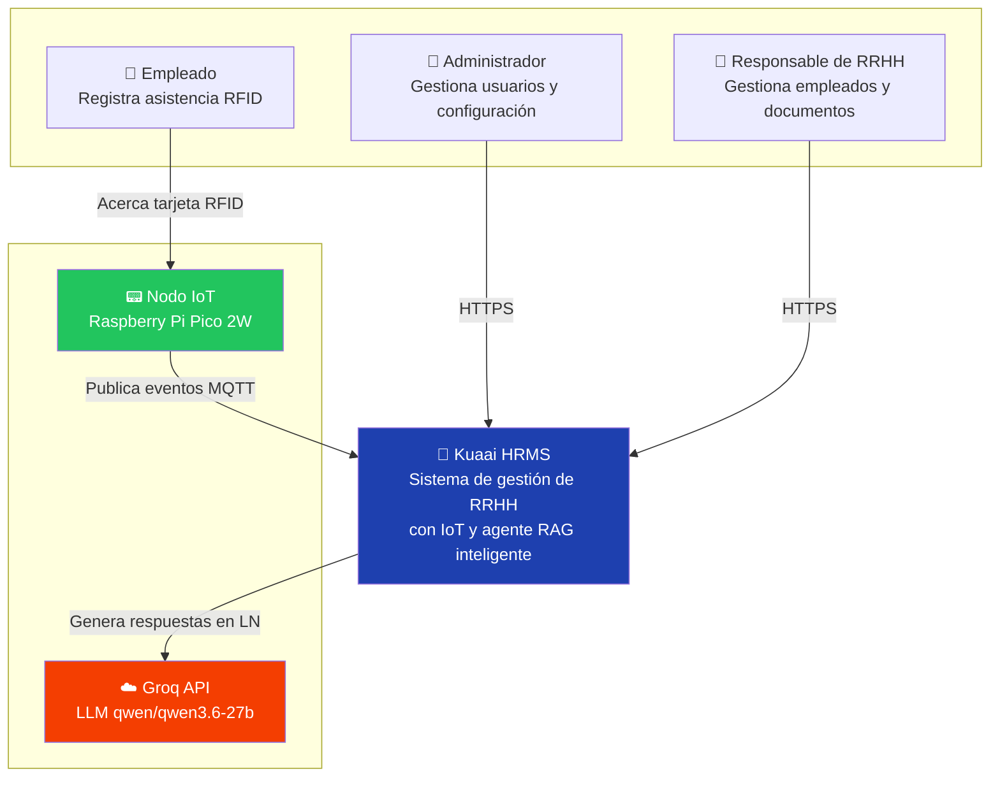
```mermaid
graph TB
    subgraph USERS [" "]
        ADMIN["👤 Administrador\nGestiona usuarios y configuración"]
        RRHH["👤 Responsable de RRHH\nGestiona empleados y documentos"]
        EMP["👷 Empleado\nRegistra asistencia RFID"]
    end

    KUAAI["🏢 Kuaai HRMS\nSistema de gestión de RRHH\ncon IoT y agente RAG inteligente"]

    subgraph EXT [" "]
        GROQ["☁️ Groq API\nLLM qwen/qwen3.6-27b"]
        IOT_CTX["📟 Nodo IoT\nRaspberry Pi Pico 2W"]
    end

    ADMIN -->|"HTTPS"| KUAAI
    RRHH  -->|"HTTPS"| KUAAI
    EMP   -->|"Acerca tarjeta RFID"| IOT_CTX
    IOT_CTX -->|"Publica eventos MQTT"| KUAAI
    KUAAI -->|"Genera respuestas en LN"| GROQ

    style KUAAI fill:#1e40af,color:#fff
    style GROQ  fill:#F43E01,color:#fff
    style IOT_CTX fill:#22C55E,color:#fff
```

### Diagrama — Nivel 2: Contenedores (servicios)

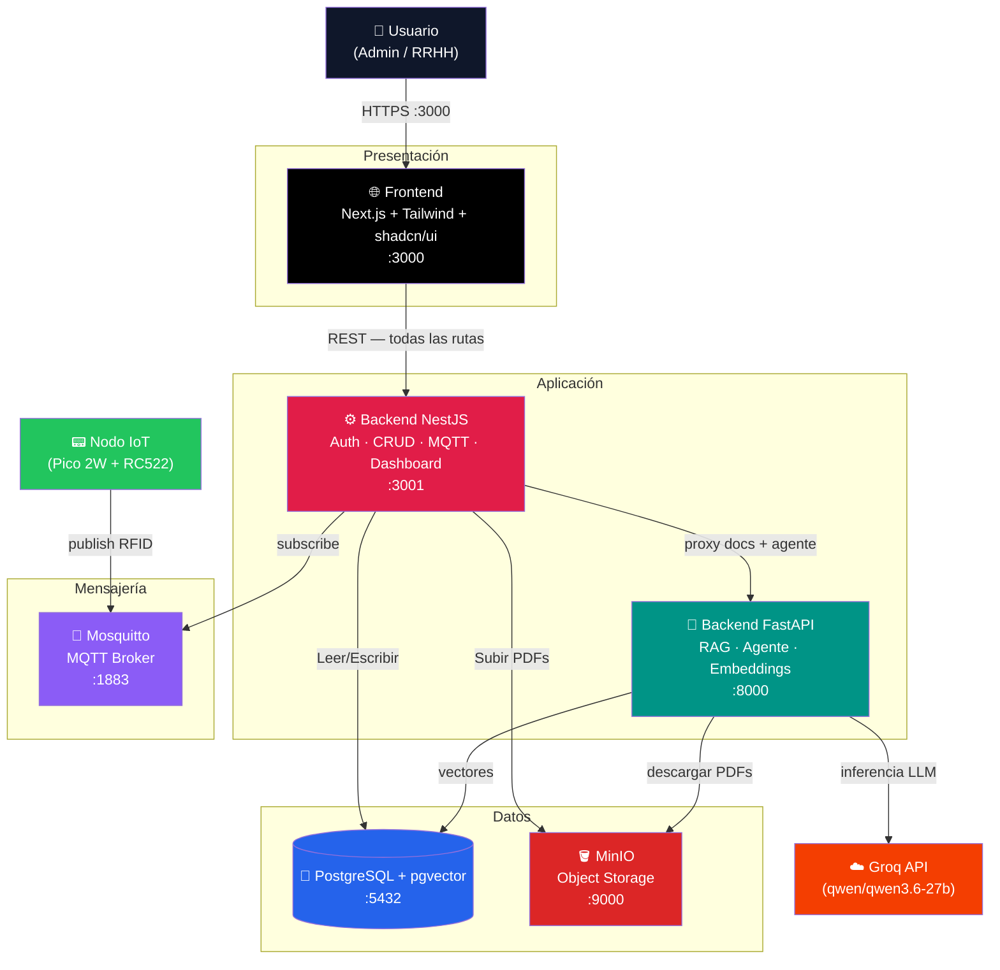
```mermaid
graph TB
    USER["👤 Usuario\n(Admin / RRHH)"]
    IOT["📟 Nodo IoT\n(Pico 2W + RC522)"]
    GROQ["☁️ Groq API\n(qwen/qwen3.6-27b)"]

    subgraph PRES ["Presentación"]
        FE["🌐 Frontend\nNext.js + Tailwind + shadcn/ui\n:3000"]
    end

    subgraph APP ["Aplicación"]
        NEST["⚙️ Backend NestJS\nAuth · CRUD · MQTT · Dashboard\n:3001"]
        FAPI["🤖 Backend FastAPI\nRAG · Agente · Embeddings\n:8000"]
    end

    subgraph MSG ["Mensajería"]
        MQTT["📡 Mosquitto\nMQTT Broker\n:1883"]
    end

    subgraph DATA ["Datos"]
        PG[("🐘 PostgreSQL + pgvector\n:5432")]
        MINIO["🪣 MinIO\nObject Storage\n:9000"]
    end

    USER  -->|"HTTPS :3000"| FE
    FE    -->|"REST — todas las rutas"| NEST
    NEST  -->|"proxy docs + agente"| FAPI
    NEST  -->|"Leer/Escribir"| PG
    NEST  -->|"Subir PDFs"| MINIO
    NEST  -->|"subscribe"| MQTT
    FAPI  -->|"vectores"| PG
    FAPI  -->|"descargar PDFs"| MINIO
    FAPI  -->|"inferencia LLM"| GROQ
    IOT   -->|"publish RFID"| MQTT

    style FE   fill:#000000,color:#fff
    style NEST fill:#e11d48,color:#fff
    style FAPI fill:#009486,color:#fff
    style PG   fill:#2563EB,color:#fff
    style MINIO fill:#DC2626,color:#fff
    style MQTT fill:#8B5CF6,color:#fff
    style USER fill:#0f172a,color:#fff
    style IOT  fill:#22C55E,color:#fff
    style GROQ fill:#F43E01,color:#fff
```

---

## 2. Fase 1 — Infraestructura base

### Estructura del monorepo

```
kuaai-intelligent-hrms/
├── apps/
│   ├── frontend/           # Next.js 16 + Tailwind + shadcn/ui
│   ├── backend-nest/       # NestJS — Auth, CRUD, MQTT, Dashboard
│   ├── backend-fastapi/    # FastAPI — RAG, Agente, Embeddings
│   └── iot-node/           # MicroPython — Raspberry Pi Pico 2W
├── infra/
│   ├── postgres/
│   │   └── init.sql        # CREATE EXTENSION vector + 6 tablas
│   ├── minio/
│   │   └── init-minio.sh   # Crea bucket 'documents'
│   └── mosquitto/
│       └── mosquitto.conf  # Listener 1883, allow_anonymous
├── docker-compose.yml
├── docker-compose.dev.yml
├── .env.example
├── .gitignore
├── ARCHITECTURE.md      # este documento
└── DESIGN.md
```

### Diagrama de deployment (Docker Compose)

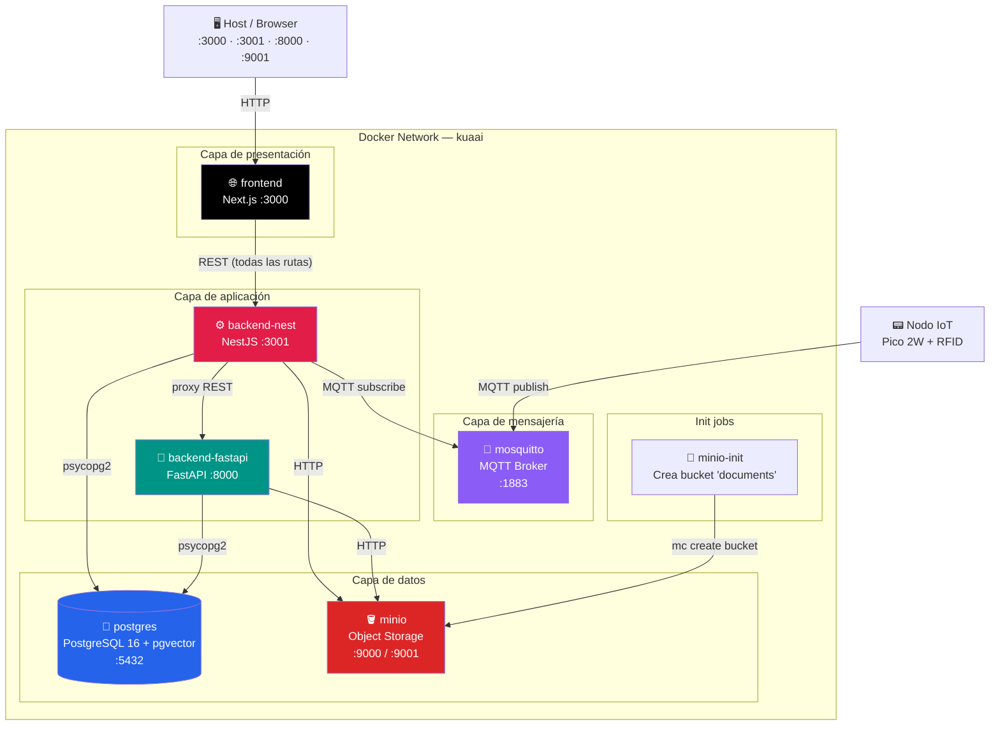
```mermaid
graph TB
    subgraph "Docker Network — kuaai"
        direction TB

        subgraph "Capa de presentación"
            FE["🌐 frontend\nNext.js :3000"]
        end

        subgraph "Capa de aplicación"
            NEST["⚙️ backend-nest\nNestJS :3001"]
            FAPI["🤖 backend-fastapi\nFastAPI :8000"]
        end

        subgraph "Capa de mensajería"
            MQTT["📡 mosquitto\nMQTT Broker\n:1883"]
        end

        subgraph "Capa de datos"
            PG[("🐘 postgres\nPostgreSQL 16 + pgvector\n:5432")]
            MINIO["🪣 minio\nObject Storage\n:9000 / :9001"]
        end

        subgraph "Init jobs"
            MINIO_INIT["🔧 minio-init\nCrea bucket 'documents'"]
        end
    end

    HOST["🖥️ Host / Browser\n:3000 · :3001 · :8000 · :9001"]
    IOT["📟 Nodo IoT\nPico 2W + RFID"]

    HOST -->|"HTTP"| FE
    FE -->|"REST (todas las rutas)"| NEST
    NEST -->|"proxy REST"| FAPI
    NEST -->|"psycopg2"| PG
    NEST -->|"HTTP"| MINIO
    NEST -->|"MQTT subscribe"| MQTT
    FAPI -->|"psycopg2"| PG
    FAPI -->|"HTTP"| MINIO
    IOT -->|"MQTT publish"| MQTT
    MINIO_INIT -->|"mc create bucket"| MINIO

    style FE fill:#000000,color:#fff
    style NEST fill:#e11d48,color:#fff
    style FAPI fill:#009486,color:#fff
    style PG fill:#2563EB,color:#fff
    style MINIO fill:#DC2626,color:#fff
    style MQTT fill:#8B5CF6,color:#fff
```

### Variables de entorno clave (.env)

| Variable | Valor por defecto | Descripción |
|---|---|---|
| `POSTGRES_HOST` | `postgres` | Host del contenedor PostgreSQL |
| `POSTGRES_DB` | `kuaai` | Nombre de la base de datos |
| `MINIO_BUCKET_DOCUMENTS` | `documents` | Bucket para PDFs |
| `MQTT_TOPIC_ATTENDANCE` | `attendance/checkin` | Topic MQTT del nodo IoT |
| `GROQ_API_KEY` | — | API key de Groq (requerida) |
| `JWT_SECRET` | — | Secret para firmar JWT (requerido) |
| `EMBEDDINGS_MODEL` | `paraphrase-multilingual-MiniLM-L12-v2` | Modelo de embeddings (384 dims) |

---

## 3. Fase 2 — Backend NestJS

### Diagrama de módulos

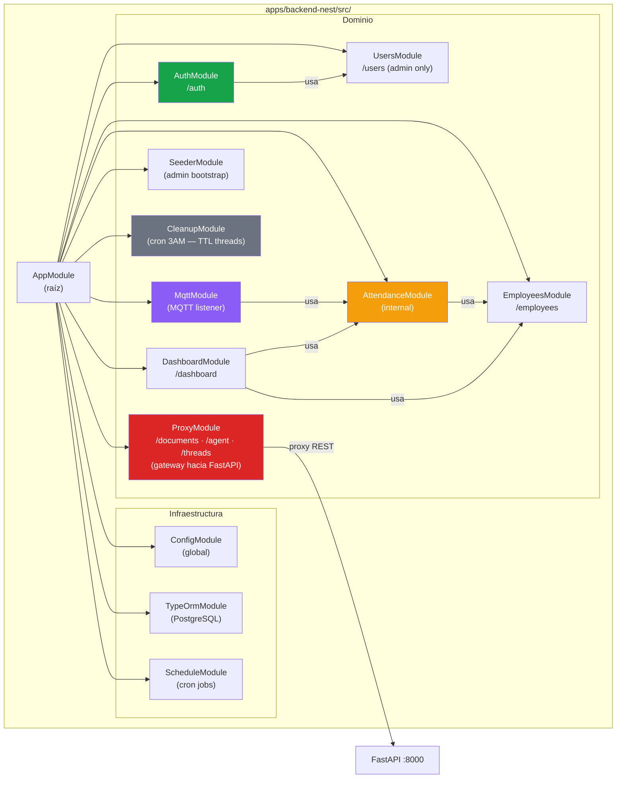
```mermaid
graph LR
    subgraph "apps/backend-nest/src/"
        AM["AppModule\n(raíz)"]

        subgraph "Infraestructura"
            CONFIG["ConfigModule\n(global)"]
            TYPEORM["TypeOrmModule\n(PostgreSQL)"]
            SCHED["ScheduleModule\n(cron jobs)"]
        end

        subgraph "Dominio"
            AUTH["AuthModule\n/auth"]
            USERS["UsersModule\n/users (admin only)"]
            EMP["EmployeesModule\n/employees"]
            ATT["AttendanceModule\n(internal)"]
            DASH["DashboardModule\n/dashboard"]
            MQ["MqttModule\n(MQTT listener)"]
            PROXY["ProxyModule\n/documents · /agent · /threads\n(gateway hacia FastAPI)"]
            SEED["SeederModule\n(admin bootstrap)"]
            CLEAN["CleanupModule\n(cron 3AM — TTL threads)"]
        end
    end

    AM --> CONFIG
    AM --> TYPEORM
    AM --> SCHED
    AM --> AUTH
    AM --> USERS
    AM --> EMP
    AM --> ATT
    AM --> DASH
    AM --> MQ
    AM --> PROXY
    AM --> SEED
    AM --> CLEAN

    AUTH -->|"usa"| USERS
    MQ -->|"usa"| ATT
    ATT -->|"usa"| EMP
    DASH -->|"usa"| ATT
    DASH -->|"usa"| EMP
    PROXY -->|"proxy REST"| FAPI_REF["FastAPI :8000"]

    style AUTH fill:#16a34a,color:#fff
    style MQ fill:#8b5cf6,color:#fff
    style ATT fill:#f59e0b,color:#fff
    style PROXY fill:#dc2626,color:#fff
    style CLEAN fill:#6b7280,color:#fff
```

### Endpoints expuestos

| Método | Ruta | Guard | Descripción |
|--------|------|-------|-------------|
| `POST` | `/auth/login` | Público | Retorna JWT |
| `GET` | `/auth/me` | JWT | Usuario autenticado |
| `POST` | `/auth/logout` | JWT | Cierra sesión |
| `GET` | `/employees` | JWT | Lista paginada con filtros |
| `GET` | `/employees/:id` | JWT | Detalle de empleado |
| `POST` | `/employees` | JWT | Crear empleado |
| `PUT` | `/employees/:id` | JWT | Editar empleado |
| `DELETE` | `/employees/:id` | JWT | Dar de baja (→ INACTIVO) |
| `GET` | `/dashboard/today` | JWT | Asistencia del día |
| `GET` | `/dashboard/monthly-average` | JWT | Promedio mensual |
| `GET` | `/dashboard/recent-entries` | JWT | Últimas entradas del día actual |
| `GET` | `/dashboard/tardiness` | JWT | Reporte de tardanzas |
| `GET` | `/dashboard/monthly-absences` | JWT | Reporte de ausencias del mes |
| `GET` | `/users` | JWT + admin | Lista usuarios RRHH |
| `GET` | `/users/:id` | JWT + admin | Detalle de usuario |
| `POST` | `/users` | JWT + admin | Crea usuario RRHH (el admin único se crea por seeder, no por este endpoint) |
| `PATCH` | `/users/:id` | JWT + admin | Edita email/password/is_active |
| `PATCH` | `/users/:id/deactivate` | JWT + admin | Desactiva usuario |

Además, `ProxyModule` reenvía con guard JWT (sin chequeo de rol) las rutas
`/documents/*`, `/agent/*` y `/threads/*` hacia FastAPI — ver
[docs/api/nest-endpoints.md](docs/api/nest-endpoints.md) y la tabla de
endpoints FastAPI más abajo.

### Lógica de asistencia (AttendanceService)

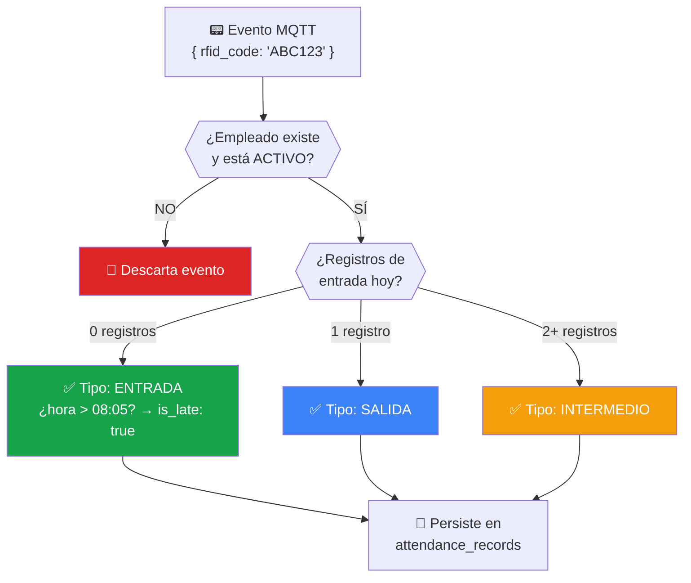
```mermaid
flowchart TD
    RFID["📟 Evento MQTT\n{ rfid_code: 'ABC123' }"]
    CHECK_EMP{{"¿Empleado existe\ny está ACTIVO?"}}
    DISCARD["🚫 Descarta evento"]
    COUNT{{"¿Registros de\nentrada hoy?"}}
    ENTRADA["✅ Tipo: ENTRADA\n¿hora > 08:05? → is_late: true"]
    SALIDA["✅ Tipo: SALIDA"]
    INTER["✅ Tipo: INTERMEDIO"]
    SAVE["💾 Persiste en\nattendance_records"]

    RFID --> CHECK_EMP
    CHECK_EMP -->|"NO"| DISCARD
    CHECK_EMP -->|"SÍ"| COUNT
    COUNT -->|"0 registros"| ENTRADA
    COUNT -->|"1 registro"| SALIDA
    COUNT -->|"2+ registros"| INTER
    ENTRADA --> SAVE
    SALIDA --> SAVE
    INTER --> SAVE

    style ENTRADA fill:#16a34a,color:#fff
    style SALIDA fill:#3b82f6,color:#fff
    style INTER fill:#f59e0b,color:#fff
    style DISCARD fill:#dc2626,color:#fff
```

**Cron job — Salida automática (16:00, lun-vie):**  
Para cada empleado activo con ENTRADA registrada pero sin SALIDA, se genera automáticamente un registro con `auto_generated: true`.

### Entidades TypeORM

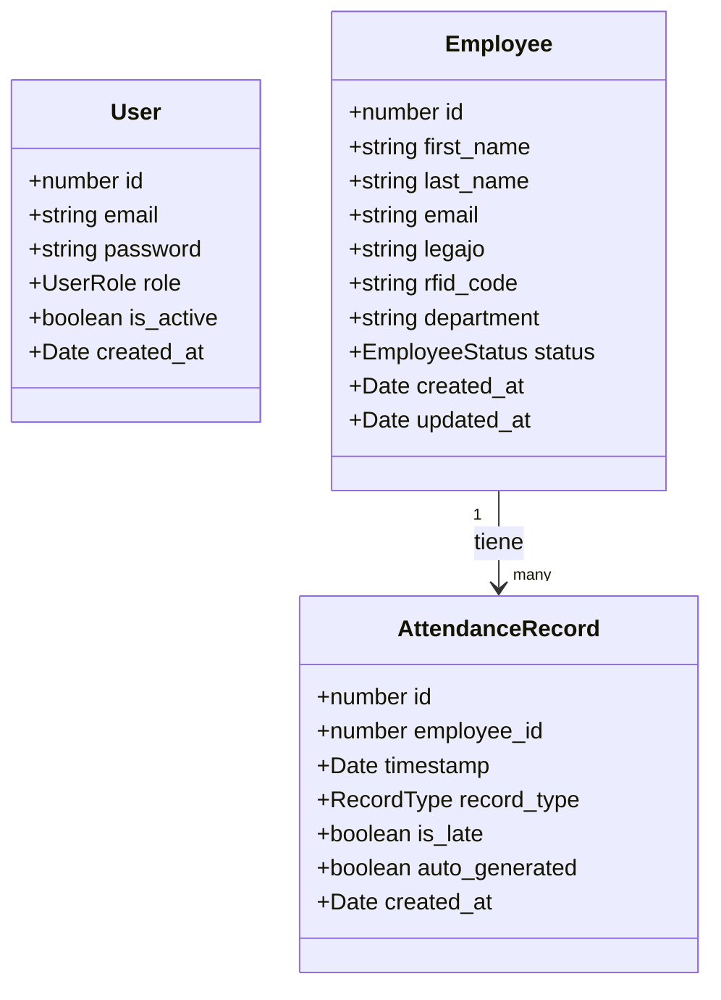
```mermaid
classDiagram
    class User {
        +number id
        +string email
        +string password
        +UserRole role
        +boolean is_active
        +Date created_at
    }
    class Employee {
        +number id
        +string first_name
        +string last_name
        +string email
        +string legajo
        +string rfid_code
        +string department
        +EmployeeStatus status
        +Date created_at
        +Date updated_at
    }
    class AttendanceRecord {
        +number id
        +number employee_id
        +Date timestamp
        +RecordType record_type
        +boolean is_late
        +boolean auto_generated
        +Date created_at
    }

    Employee "1" --> "many" AttendanceRecord : tiene
```

---

## 4. Fase 3 — Backend FastAPI + Agente RAG

### Diagrama de módulos

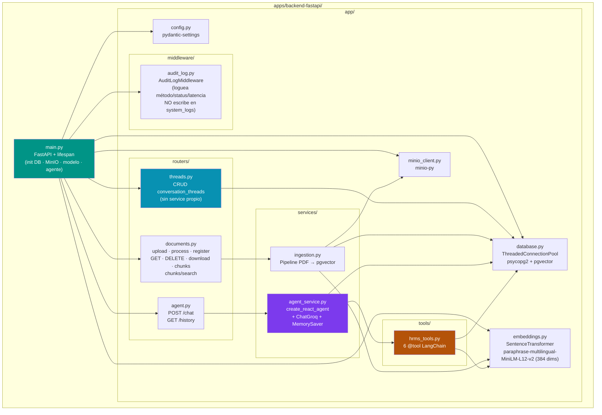
```mermaid
graph TB
    subgraph "apps/backend-fastapi/"
        MAIN["main.py\nFastAPI + lifespan\n(init DB · MinIO · modelo · agente)"]

        subgraph "app/"
            CONFIG2["config.py\npydantic-settings"]
            DB["database.py\nThreadedConnectionPool\npsycopg2 + pgvector"]
            MINIO2["minio_client.py\nminio-py"]
            EMB["embeddings.py\nSentenceTransformer\nparaphrase-multilingual-MiniLM-L12-v2 (384 dims)"]

            subgraph "routers/"
                R_DOCS["documents.py\nupload · process · register\nGET · DELETE · download · chunks\nchunks/search"]
                R_AGENT["agent.py\nPOST /chat\nGET /history"]
                R_THREADS["threads.py\nCRUD conversation_threads\n(sin service propio)"]
            end

            subgraph "middleware/"
                MW_AUDIT["audit_log.py\nAuditLogMiddleware\n(loguea método/status/latencia\nNO escribe en system_logs)"]
            end

            subgraph "services/"
                S_ING["ingestion.py\nPipeline PDF → pgvector"]
                S_AGT["agent_service.py\ncreate_react_agent\n+ ChatGroq + MemorySaver"]
            end

            subgraph "tools/"
                TOOLS["hrms_tools.py\n6 @tool LangChain"]
            end
        end
    end

    MAIN --> CONFIG2
    MAIN --> DB
    MAIN --> MINIO2
    MAIN --> EMB
    MAIN --> MW_AUDIT
    MAIN --> R_DOCS
    MAIN --> R_AGENT
    MAIN --> R_THREADS

    R_DOCS --> S_ING
    R_AGENT --> S_AGT
    R_THREADS --> DB
    S_ING --> DB
    S_ING --> MINIO2
    S_ING --> EMB
    S_AGT --> TOOLS
    S_AGT --> DB
    TOOLS --> DB
    TOOLS --> EMB

    style MAIN fill:#009486,color:#fff
    style S_AGT fill:#7c3aed,color:#fff
    style TOOLS fill:#b45309,color:#fff
    style R_THREADS fill:#0891b2,color:#fff
```

### Pipeline de ingestión de documentos

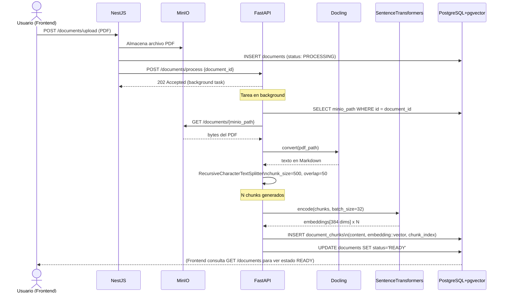
```mermaid
sequenceDiagram
    actor U as Usuario (Frontend)
    participant N as NestJS
    participant M as MinIO
    participant F as FastAPI
    participant D as Docling
    participant S as SentenceTransformers
    participant PG as PostgreSQL+pgvector

    U->>N: POST /documents/upload (PDF)
    N->>M: Almacena archivo PDF
    N->>PG: INSERT documents (status: PROCESSING)
    N->>F: POST /documents/process {document_id}
    F-->>N: 202 Accepted (background task)

    Note over F: Tarea en background

    F->>PG: SELECT minio_path WHERE id = document_id
    F->>M: GET /documents/{minio_path}
    M-->>F: bytes del PDF

    F->>D: convert(pdf_path)
    D-->>F: texto en Markdown

    F->>F: RecursiveCharacterTextSplitter\nchunk_size=500, overlap=50
    Note over F: N chunks generados

    F->>S: encode(chunks, batch_size=32)
    S-->>F: embeddings[384 dims] x N

    F->>PG: INSERT document_chunks\n(content, embedding::vector, chunk_index)
    F->>PG: UPDATE documents SET status='READY'

    PG-->>U: (Frontend consulta GET /documents para ver estado READY)
```

### Flujo del agente RAG

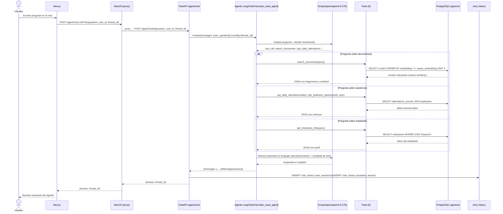
```mermaid
sequenceDiagram
    actor U as Usuario
    participant FE as Next.js
    participant N as NestJS (proxy)
    participant FA as FastAPI /agent/chat
    participant AG as Agente LangChain\n(create_react_agent)
    participant LLM as Groq\n(qwen/qwen3.6-27b)
    participant T as Tools (6)
    participant PG as PostgreSQL+pgvector
    participant DB as chat_history

    U->>FE: Escribe pregunta en el chat
    FE->>N: POST /agent/chat (JWT)\n{question, user_id, thread_id}
    N->>FA: proxy → POST /agent/chat\n{question, user_id, thread_id}

    FA->>AG: invoke({messages: [user_question]},\nconfig={thread_id})

    AG->>LLM: Analiza pregunta + decide herramienta
    LLM-->>AG: tool_call: search_documents / get_daily_attendance / ...

    alt Pregunta sobre documentos
        AG->>T: search_documents(query)
        T->>PG: SELECT content ORDER BY embedding <=> query_embedding LIMIT 4
        PG-->>T: chunks relevantes (cosine similarity)
        T-->>AG: JSON con fragmentos y similitud
    else Pregunta sobre asistencia
        AG->>T: get_daily_attendance(date) / get_tardiness_report(month, year)
        T->>PG: SELECT attendance_records JOIN employees
        PG-->>T: datos estructurados
        T-->>AG: JSON con métricas
    else Pregunta sobre empleado
        AG->>T: get_employee_info(query)
        T->>PG: SELECT employees WHERE ILIKE %query%
        PG-->>T: datos del empleado
        T-->>AG: JSON con perfil
    end

    AG->>LLM: Genera respuesta en lenguaje natural\n(contexto + resultado de tool)
    LLM-->>AG: respuesta en español

    AG-->>FA: {messages: [..., AIMessage(answer)]}
    FA->>DB: INSERT chat_history (user, question)\nINSERT chat_history (assistant, answer)
    FA-->>N: {answer, thread_id}
    N-->>FE: {answer, thread_id}
    FE-->>U: Muestra respuesta del agente
```

### Herramientas del agente (6 @tool)

| Herramienta | Descripción | Fuente de datos |
|---|---|---|
| `search_documents` | Búsqueda semántica en documentos empresariales | pgvector (cosine similarity) |
| `get_daily_attendance` | Asistencia del día: presentes, ausentes, tardanzas | `attendance_records` |
| `get_employee_attendance` | Resumen mensual de un empleado | `attendance_records` |
| `get_tardiness_report` | Empleados con tardanzas en el mes | `attendance_records` |
| `get_monthly_summary` | Estadísticas generales del mes | `attendance_records` |
| `get_employee_info` | Búsqueda de empleado por nombre/legajo | `employees` |

### Endpoints FastAPI

| Método | Ruta | Descripción |
|--------|------|-------------|
| `POST` | `/documents/upload` | Sube PDF a MinIO + registra documento (entry point real desde el frontend) |
| `POST` | `/documents/register` | Registra documento (status: PROCESSING) |
| `POST` | `/documents/process` | Lanza pipeline ingestión en background |
| `GET` | `/documents/` | Lista todos los documentos |
| `GET` | `/documents/:id` | Detalle de documento |
| `GET` | `/documents/:id/download` | Descarga el PDF original (para el visor en frontend) |
| `GET` | `/documents/:id/chunks` | Lista los chunks generados de un documento |
| `POST` | `/documents/chunks/search` | Búsqueda semántica manual sobre chunks (panel admin) |
| `DELETE` | `/documents/:id` | Elimina documento y sus chunks |
| `POST` | `/agent/chat` | Consulta al agente RAG |
| `GET` | `/agent/history/:user_id` | Historial de conversación (filtrable por `thread_id`) |
| `POST` | `/threads/` | Crea un hilo de conversación |
| `GET` | `/threads/:user_id` | Lista los hilos de un usuario |
| `PATCH` | `/threads/:thread_id/rename` | Renombra un hilo |
| `DELETE` | `/threads/:thread_id` | Elimina un hilo |
| `GET` | `/health` | Health check |

### Hilos de conversación y logs de sistema (Sprints 2/3)

Agregado después de la fase 3 inicial (commits `68a2952`, `23a1ba1`,
`89168d1`, `15617ba` — 2026-06-16), no cubierto por los docs de fase
originales:

**Hilos múltiples (`conversation_threads`):** antes de este cambio, cada
usuario tenía un único thread implícito (`user-{user_id}`) para memoria del
agente. Ahora el frontend puede crear varios hilos por usuario (panel
lateral en la página de chat), cada uno con su propio historial en
`chat_history.thread_id`. Un cron (`CleanupService`, `@Cron(EVERY_DAY_AT_3AM)`
en `apps/backend-nest/src/cleanup/cleanup.service.ts`) borra los hilos con
`last_message_at` de más de 30 días (valor hardcodeado, no configurable por
env var).

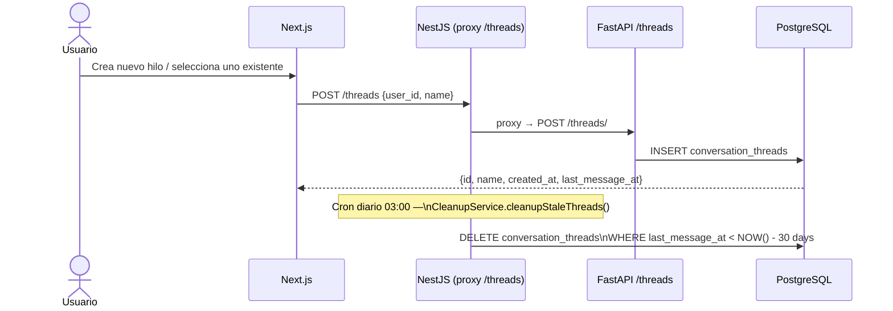
```mermaid
sequenceDiagram
    actor U as Usuario
    participant FE as Next.js
    participant N as NestJS (proxy /threads)
    participant FA as FastAPI /threads
    participant PG as PostgreSQL

    U->>FE: Crea nuevo hilo / selecciona uno existente
    FE->>N: POST /threads {user_id, name}
    N->>FA: proxy → POST /threads/
    FA->>PG: INSERT conversation_threads
    PG-->>FE: {id, name, created_at, last_message_at}

    Note over N: Cron diario 03:00 —\nCleanupService.cleanupStaleThreads()
    N->>PG: DELETE conversation_threads\nWHERE last_message_at < NOW() - 30 days
```

**Logs de sistema (`system_logs`):** la migración `003_system_logs.sql`
agregó esta tabla para auditoría (`level`, `service`, `event`, `detail
JSONB`). En la práctica, **hoy nada la escribe**: `AuditLogMiddleware`
(FastAPI, `app/middleware/audit_log.py`) y `LoggingInterceptor` (NestJS,
`src/logging/logging.interceptor.ts`) solo loguean método/ruta/status/latencia
al logger de cada proceso (stdout / archivo), no insertan filas en la tabla.
Es un gap entre lo que sugiere el nombre del commit ("persistidos en la
tabla system_logs") y el código real — vale la pena revisarlo si se necesita
auditoría persistente real.

---

## 5. Modelo de datos

### Diagrama entidad-relación


```mermaid
erDiagram
    users {
        serial id PK
        varchar email UK
        varchar password
        varchar role "admin | rrhh"
        boolean is_active
        timestamp created_at
    }

    employees {
        serial id PK
        varchar first_name
        varchar last_name
        varchar email UK
        varchar legajo UK
        varchar rfid_code UK
        varchar department
        varchar status "ACTIVO | INACTIVO"
        timestamp created_at
        timestamp updated_at
    }

    attendance_records {
        serial id PK
        integer employee_id FK
        timestamp timestamp
        varchar record_type "ENTRADA | SALIDA | INTERMEDIO"
        boolean is_late
        boolean auto_generated
        timestamp created_at
    }

    documents {
        uuid id PK
        varchar name
        varchar minio_path
        varchar status "PROCESSING | READY | ERROR"
        integer uploaded_by FK
        timestamp created_at
    }

    document_chunks {
        serial id PK
        uuid document_id FK
        text content
        vector embedding "384 dims"
        integer chunk_index
        timestamp created_at
    }

    chat_history {
        serial id PK
        integer user_id FK
        varchar role "user | assistant"
        text content
        uuid thread_id FK "nullable"
        timestamp created_at
    }

    conversation_threads {
        uuid id PK
        integer user_id FK
        varchar name "default 'Nueva conversación'"
        timestamp created_at
        timestamp last_message_at
    }

    system_logs {
        bigserial id PK
        varchar level "INFO | WARN | ERROR"
        varchar service "nest | fastapi"
        varchar event
        integer user_id FK "nullable"
        jsonb detail
        timestamp created_at
    }

    employees ||--o{ attendance_records : "tiene"
    users ||--o{ documents : "sube"
    documents ||--o{ document_chunks : "tiene"
    users ||--o{ chat_history : "genera"
    users ||--o{ conversation_threads : "tiene"
    conversation_threads ||--o{ chat_history : "agrupa"
    users ||--o{ system_logs : "genera (opcional)"
```

> **Nota:** `system_logs` (migración `003_system_logs.sql`) existe en el
> esquema pero **hoy no la escribe ningún código** — ni
> `AuditLogMiddleware` (FastAPI) ni `LoggingInterceptor` (NestJS) insertan
> ahí; ambos solo loguean a stdout/archivo. Ver la sección de threads y
> logs de sistema más abajo.

---

## 6. Flujos de operación críticos

### Flujo 1 — Login y autenticación

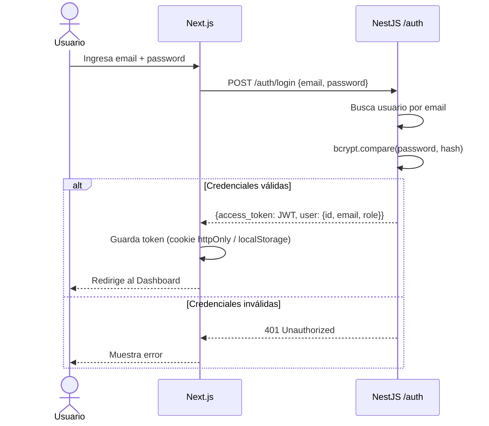
```mermaid
sequenceDiagram
    actor U as Usuario
    participant FE as Next.js
    participant N as NestJS /auth

    U->>FE: Ingresa email + password
    FE->>N: POST /auth/login {email, password}
    N->>N: Busca usuario por email
    N->>N: bcrypt.compare(password, hash)
    alt Credenciales válidas
        N-->>FE: {access_token: JWT, user: {id, email, role}}
        FE->>FE: Guarda token (cookie httpOnly / localStorage)
        FE-->>U: Redirige al Dashboard
    else Credenciales inválidas
        N-->>FE: 401 Unauthorized
        FE-->>U: Muestra error
    end
```

### Flujo 2 — Registro RFID IoT

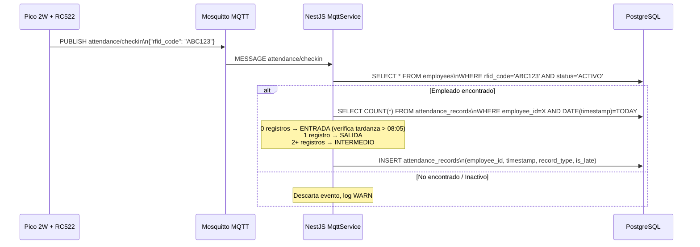
```mermaid
sequenceDiagram
    participant HW as Pico 2W + RC522
    participant MQ as Mosquitto MQTT
    participant N as NestJS MqttService
    participant DB as PostgreSQL

    HW->>MQ: PUBLISH attendance/checkin\n{"rfid_code": "ABC123"}
    MQ->>N: MESSAGE attendance/checkin
    N->>DB: SELECT * FROM employees\nWHERE rfid_code='ABC123' AND status='ACTIVO'
    alt Empleado encontrado
        N->>DB: SELECT COUNT(*) FROM attendance_records\nWHERE employee_id=X AND DATE(timestamp)=TODAY
        Note over N: 0 registros → ENTRADA (verifica tardanza > 08:05)<br/>1 registro → SALIDA<br/>2+ registros → INTERMEDIO
        N->>DB: INSERT attendance_records\n(employee_id, timestamp, record_type, is_late)
    else No encontrado / Inactivo
        Note over N: Descarta evento, log WARN
    end
```

---

*Generado con el skill `aj-geddes/useful-ai-prompts@architecture-diagrams`*  
*Diagramas en formato Mermaid — renderizables en GitHub, GitLab, Notion, Obsidian*
