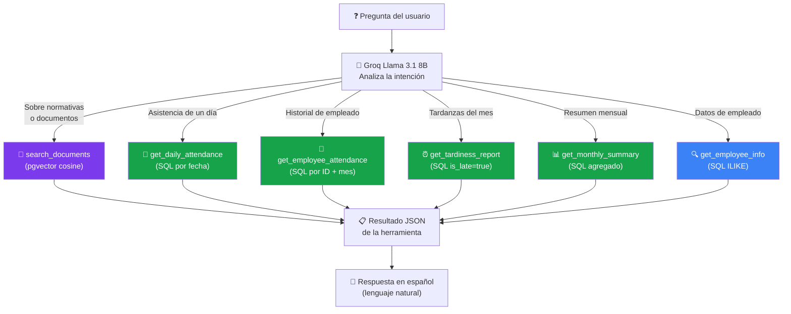

# Agent Tools

## Descripción del agente (patrón ReAct)

El agente de Kuaai utiliza el patrón **ReAct** (Reasoning + Acting), implementado con `create_react_agent` de LangGraph y el LLM `Llama 3.1 8B` via Groq API.

**Ciclo de razonamiento:**

```
1. THINK  → El LLM analiza la pregunta y decide qué herramienta usar
2. ACT    → Ejecuta la herramienta (SQL directo a PostgreSQL o búsqueda en pgvector)
3. OBSERVE → El LLM recibe el resultado JSON de la herramienta
4. THINK  → Decide si necesita más herramientas o puede responder
5. ANSWER → Genera la respuesta final en lenguaje natural (español)
```

**Configuración del agente:**

```python
agent = create_react_agent(
    model=ChatGroq(model="llama-3.1-8b-instant", temperature=0, max_retries=0),
    tools=ALL_TOOLS,                # 6 herramientas
    checkpointer=MemorySaver(),     # memoria de conversación por thread_id
)

# Invocación con system prompt dinámico, thread para memoria y límite de pasos
result = agent.invoke(
    {
        "messages": [
            {"role": "system", "content": system_prompt},  # incluye fecha de hoy
            {"role": "user", "content": question},
        ]
    },
    config={
        "configurable": {"thread_id": "user-1"},
        "recursion_limit": 25,
    }
)
```

**System prompt (dinámico, incluye fecha de hoy):**
> Eres Kuaai, el asistente inteligente de Recursos Humanos de la empresa.
> Hoy es {today}. Usa esta fecha cuando el usuario diga "hoy", "este mes" o "el mes actual".
> Tenés herramientas para consultar documentos empresariales, asistencia diaria y mensual, información de empleados y reportes de tardanzas. Usá las herramientas antes de responder.
> Respondé SIEMPRE en español, de forma clara y concisa.

---

## Tabla de herramientas

| # | Herramienta | Parámetros | Fuente de datos | Tipo de consulta |
|---|---|---|---|---|
| 1 | `search_documents` | `query: str` | pgvector | Similitud coseno (`<=>`) |
| 2 | `get_daily_attendance` | `date: str` (YYYY-MM-DD) | `attendance_records` | SQL JOIN |
| 3 | `get_employee_attendance` | `employee_id: int, month: int, year: int` | `attendance_records` | SQL GROUP BY |
| 4 | `get_tardiness_report` | `month: int, year: int` | `attendance_records` | SQL + is_late filter |
| 5 | `get_monthly_summary` | `month: int, year: int` | `attendance_records` | SQL agregado |
| 6 | `get_employee_info` | `query: str` | `employees` | SQL ILIKE |

---

## Detalle de cada herramienta

### 1. `search_documents`

**Descripción:** Busca información en los documentos empresariales cargados (políticas, reglamentos, manuales). Retorna los 4 fragmentos más relevantes con su similitud.

**Parámetros:**

| Parámetro | Tipo | Descripción |
|-----------|------|-------------|
| `query` | `str` | La pregunta o término a buscar en los documentos |

**Fuente de datos:** tabla `document_chunks` con extensión pgvector.

**Consulta SQL:**
```sql
SELECT
    dc.content,
    d.name AS document_name,
    ROUND((1 - (dc.embedding <=> $1::vector))::numeric, 3) AS similarity
FROM document_chunks dc
JOIN documents d ON dc.document_id = d.id
WHERE d.status = 'READY'
ORDER BY dc.embedding <=> $1::vector
LIMIT 4;
```

**Retorna (JSON):**
```json
[
  {
    "fragment": "Los empleados tienen derecho a 15 días hábiles de vacaciones anuales...",
    "documento": "Reglamento Interno.pdf",
    "similitud": 0.891
  }
]
```

**Ejemplos de consultas que la disparan:**
- *"¿Cuántos días de vacaciones corresponden?"*
- *"¿Cuál es el procedimiento para pedir licencia?"*
- *"¿Qué dice el reglamento sobre el uso del uniforme?"*

---

### 2. `get_daily_attendance`

**Descripción:** Retorna la asistencia del día indicado. Incluye empleados presentes, ausentes y cuántos llegaron tarde.

**Parámetros:**

| Parámetro | Tipo | Descripción |
|-----------|------|-------------|
| `date` | `str` | Fecha en formato YYYY-MM-DD (ej: `2026-05-11`) |

**Consulta SQL:**
```sql
SELECT
    e.first_name || ' ' || e.last_name AS nombre,
    e.department AS departamento,
    ar.is_late AS tardanza,
    ar.timestamp::time AS hora_entrada
FROM attendance_records ar
JOIN employees e ON ar.employee_id = e.id
WHERE DATE(ar.timestamp) = $1 AND ar.record_type = 'ENTRADA'
ORDER BY ar.timestamp;
```

**Retorna (JSON):**
```json
{
  "fecha": "2026-05-11",
  "total_activos": 10,
  "presentes": 8,
  "ausentes": 2,
  "tardanzas": 1,
  "detalle": [
    { "nombre": "Juan García", "departamento": "Administración", "tardanza": false, "hora_entrada": "07:58:30" }
  ]
}
```

**Ejemplos de consultas que la disparan:**
- *"¿Cuántos empleados vinieron hoy?"*
- *"¿Quiénes faltaron el 2026-05-10?"*
- *"Dame la asistencia del lunes pasado"*

---

### 3. `get_employee_attendance`

**Descripción:** Retorna el resumen de asistencias de un empleado en un mes y año específico. Incluye días presentes, tardanzas y salidas automáticas.

**Parámetros:**

| Parámetro | Tipo | Descripción |
|-----------|------|-------------|
| `employee_id` | `int` | ID numérico del empleado |
| `month` | `int` | Mes (1–12) |
| `year` | `int` | Año (ej: 2026) |

**Retorna (JSON):**
```json
{
  "empleado": "María López",
  "mes": 5,
  "anio": 2026,
  "dias_presentes": 18,
  "tardanzas": 2,
  "salidas_automaticas": 1,
  "registros": [...]
}
```

**Ejemplos de consultas que la disparan:**
- *"¿Cómo estuvo la asistencia de García en abril?"*
- *"¿Cuántos días faltó López este mes?"*
- *"Mostrame el historial del empleado 5 en mayo"*

---

### 4. `get_tardiness_report`

**Descripción:** Retorna la lista de empleados con tardanzas en el mes indicado, ordenados de mayor a menor cantidad de tardanzas.

**Parámetros:**

| Parámetro | Tipo | Descripción |
|-----------|------|-------------|
| `month` | `int` | Mes (1–12) |
| `year` | `int` | Año (ej: 2026) |

**Consulta SQL:**
```sql
SELECT
    e.first_name || ' ' || e.last_name AS nombre,
    e.department AS departamento,
    COUNT(*) AS cantidad_tardanzas
FROM attendance_records ar
JOIN employees e ON ar.employee_id = e.id
WHERE ar.is_late = true
  AND EXTRACT(MONTH FROM ar.timestamp) = $1
  AND EXTRACT(YEAR FROM ar.timestamp) = $2
GROUP BY e.id, e.first_name, e.last_name, e.department
ORDER BY cantidad_tardanzas DESC;
```

**Retorna (JSON):**
```json
{
  "mes": 5,
  "anio": 2026,
  "total_empleados_con_tardanzas": 3,
  "detalle": [
    { "nombre": "Pedro Ramírez", "departamento": "Operaciones", "cantidad_tardanzas": 4 }
  ]
}
```

**Ejemplos de consultas que la disparan:**
- *"¿Quiénes llegaron tarde en mayo?"*
- *"Dame el reporte de tardanzas de este mes"*
- *"¿Cuántas tardanzas tuvo cada empleado en abril?"*

---

### 5. `get_monthly_summary`

**Descripción:** Retorna un resumen general de asistencia del mes, con el porcentaje promedio de asistencia por día y el total de tardanzas.

**Parámetros:**

| Parámetro | Tipo | Descripción |
|-----------|------|-------------|
| `month` | `int` | Mes (1–12) |
| `year` | `int` | Año (ej: 2026) |

**Retorna (JSON):**
```json
{
  "mes": 5,
  "anio": 2026,
  "total_empleados_activos": 10,
  "dias_con_registros": 20,
  "promedio_presentes_por_dia": 8.5,
  "porcentaje_asistencia_promedio": 85.0,
  "total_tardanzas_del_mes": 7,
  "detalle_por_dia": [
    { "fecha": "2026-05-02", "presentes": 9 }
  ]
}
```

**Ejemplos de consultas que la disparan:**
- *"¿Cuál fue el porcentaje de asistencia en mayo?"*
- *"Dame el resumen del mes pasado"*
- *"¿Cómo estuvo la asistencia general en marzo?"*

---

### 6. `get_employee_info`

**Descripción:** Busca un empleado por nombre, apellido o número de legajo. Retorna sus datos básicos de perfil.

**Parámetros:**

| Parámetro | Tipo | Descripción |
|-----------|------|-------------|
| `query` | `str` | Nombre, apellido o legajo del empleado |

**Consulta SQL:**
```sql
SELECT id, first_name, last_name, email, legajo, department, status, created_at
FROM employees
WHERE
    first_name ILIKE $1
    OR last_name ILIKE $1
    OR (first_name || ' ' || last_name) ILIKE $1
    OR legajo ILIKE $1
ORDER BY last_name, first_name
LIMIT 5;
```

**Retorna (JSON):**
```json
[
  {
    "id": 3,
    "first_name": "Juan",
    "last_name": "García",
    "email": "juan.garcia@empresa.com",
    "legajo": "EMP-001",
    "department": "Administración",
    "status": "ACTIVO"
  }
]
```

**Ejemplos de consultas que la disparan:**
- *"¿Cuál es el legajo de García?"*
- *"¿En qué departamento trabaja María López?"*
- *"Buscame al empleado con legajo EMP-005"*

---

## Flujo de decisión del agente


