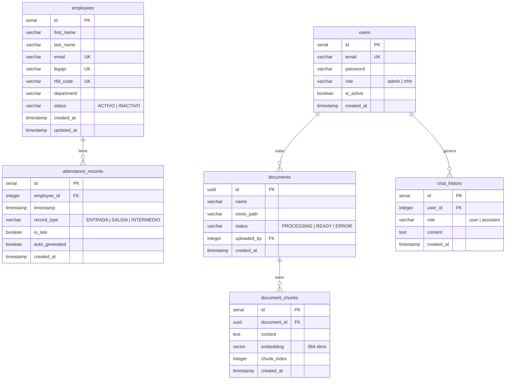

# Database Schema

## Diagrama ER



---

## Descripción de cada tabla

### `users`
Usuarios del sistema con acceso al panel web. Solo existen dos roles.

| Columna | Tipo | Descripción |
|---------|------|-------------|
| `id` | `SERIAL PK` | Identificador autoincremental |
| `email` | `VARCHAR(255) UNIQUE` | Email de login (único) |
| `password` | `VARCHAR(255)` | Hash bcrypt (saltRounds=10) |
| `role` | `VARCHAR(50)` | `admin` o `rrhh`. Check constraint. |
| `is_active` | `BOOLEAN` | Permite desactivar un usuario sin eliminarlo |
| `created_at` | `TIMESTAMP` | Fecha de creación (DEFAULT NOW()) |

---

### `employees`
Empleados de la empresa. El `rfid_code` vincula al empleado con su tarjeta física.

| Columna | Tipo | Descripción |
|---------|------|-------------|
| `id` | `SERIAL PK` | Identificador autoincremental |
| `first_name` | `VARCHAR(100)` | Nombre |
| `last_name` | `VARCHAR(100)` | Apellido |
| `email` | `VARCHAR(255) UNIQUE` | Email del empleado (nullable) |
| `legajo` | `VARCHAR(50) UNIQUE` | Número de legajo interno (único) |
| `rfid_code` | `VARCHAR(100) UNIQUE` | UID de la tarjeta RFID (único) |
| `department` | `VARCHAR(100)` | Departamento (nullable) |
| `status` | `VARCHAR(20)` | `ACTIVO` o `INACTIVO`. Check constraint. |
| `created_at` | `TIMESTAMP` | Fecha de alta |
| `updated_at` | `TIMESTAMP` | Actualizado automáticamente por trigger |

**Nota:** los empleados dados de baja conservan `status = 'INACTIVO'` para preservar el historial de asistencias. No se eliminan físicamente.

---

### `attendance_records`
Registro de cada marcación de tarjeta RFID. Un empleado puede tener múltiples registros por día.

| Columna | Tipo | Descripción |
|---------|------|-------------|
| `id` | `SERIAL PK` | Identificador autoincremental |
| `employee_id` | `INTEGER FK` | Referencia a `employees.id` |
| `timestamp` | `TIMESTAMP` | Fecha y hora exacta del evento |
| `record_type` | `VARCHAR(20)` | `ENTRADA`, `SALIDA` o `INTERMEDIO` |
| `is_late` | `BOOLEAN` | `true` si la ENTRADA fue después de las 08:15 |
| `auto_generated` | `BOOLEAN` | `true` si fue generado por el cron de las 16:00 |
| `created_at` | `TIMESTAMP` | Fecha de inserción en DB |

**Lógica de record_type:**
- Primer registro del día → `ENTRADA`
- Segundo registro del día → `SALIDA`
- Tercero en adelante → `INTERMEDIO`

---

### `documents`
Metadatos de los documentos PDF subidos por los usuarios. El archivo físico está en MinIO.

| Columna | Tipo | Descripción |
|---------|------|-------------|
| `id` | `UUID PK` | Identificador UUID generado por `gen_random_uuid()` |
| `name` | `VARCHAR(255)` | Nombre original del archivo |
| `minio_path` | `VARCHAR(500)` | Path dentro del bucket MinIO |
| `status` | `VARCHAR(20)` | `PROCESSING`, `READY` o `ERROR` |
| `uploaded_by` | `INTEGER FK` | Referencia a `users.id` (nullable) |
| `created_at` | `TIMESTAMP` | Fecha de subida |

---

### `document_chunks`
Fragmentos de texto de los documentos con sus embeddings vectoriales. Es la tabla central del sistema RAG.

| Columna | Tipo | Descripción |
|---------|------|-------------|
| `id` | `SERIAL PK` | Identificador autoincremental |
| `document_id` | `UUID FK` | Referencia a `documents.id` (ON DELETE CASCADE) |
| `content` | `TEXT` | Texto del fragmento (hasta ~1000 caracteres) |
| `embedding` | `vector(384)` | Embedding generado por `all-MiniLM-L6-v2` |
| `chunk_index` | `INTEGER` | Posición del chunk dentro del documento (0-based) |
| `created_at` | `TIMESTAMP` | Fecha de inserción |

**Búsqueda por similitud coseno:**
```sql
SELECT content, 1 - (embedding <=> '[0.1, 0.2, ...]'::vector) AS similarity
FROM document_chunks
WHERE document_id IN (SELECT id FROM documents WHERE status = 'READY')
ORDER BY embedding <=> '[0.1, 0.2, ...]'::vector
LIMIT 4;
```

---

### `chat_history`
Historial de conversaciones entre usuarios y el agente RAG. Cada par pregunta/respuesta genera dos filas.

| Columna | Tipo | Descripción |
|---------|------|-------------|
| `id` | `SERIAL PK` | Identificador autoincremental |
| `user_id` | `INTEGER FK` | Referencia a `users.id` (nullable) |
| `role` | `VARCHAR(20)` | `user` o `assistant` |
| `content` | `TEXT` | Texto del mensaje |
| `created_at` | `TIMESTAMP` | Timestamp del mensaje |

---

## Índices y extensiones

### Extensiones PostgreSQL

```sql
CREATE EXTENSION IF NOT EXISTS vector;       -- pgvector: tipo vector y operadores <=> <#> <+>
CREATE EXTENSION IF NOT EXISTS "uuid-ossp";  -- gen_random_uuid() para documents.id
```

### Índices de búsqueda vectorial

```sql
-- Índice IVFFlat para búsqueda aproximada por distancia coseno
-- lists=100 es apropiado para colecciones de hasta ~1M vectores
CREATE INDEX ON document_chunks
USING ivfflat (embedding vector_cosine_ops)
WITH (lists = 100);
```

### Índices de acceso frecuente

```sql
-- Consultas de asistencia por empleado y por fecha (muy frecuentes)
CREATE INDEX idx_attendance_employee_id ON attendance_records(employee_id);
CREATE INDEX idx_attendance_timestamp ON attendance_records(timestamp);

-- Acceso a chunks por documento (para eliminación en cascade y reproceso)
CREATE INDEX idx_chunks_document_id ON document_chunks(document_id);

-- Historial de chat por usuario
CREATE INDEX idx_chat_history_user_id ON chat_history(user_id);
```

### Trigger de updated_at

```sql
-- Actualiza employees.updated_at automáticamente en cada UPDATE
CREATE OR REPLACE FUNCTION update_updated_at_column()
RETURNS TRIGGER AS $$
BEGIN
  NEW.updated_at = NOW();
  RETURN NEW;
END;
$$ LANGUAGE plpgsql;

CREATE TRIGGER employees_updated_at
  BEFORE UPDATE ON employees
  FOR EACH ROW
  EXECUTE FUNCTION update_updated_at_column();
```

---

## Relaciones entre tablas

| Tabla origen | Columna | Tabla destino | Tipo | Comportamiento |
|---|---|---|---|---|
| `attendance_records` | `employee_id` | `employees.id` | FK | RESTRICT (no elimina empleados con registros) |
| `documents` | `uploaded_by` | `users.id` | FK | nullable |
| `document_chunks` | `document_id` | `documents.id` | FK | **ON DELETE CASCADE** (eliminar doc borra sus chunks) |
| `chat_history` | `user_id` | `users.id` | FK | nullable |
