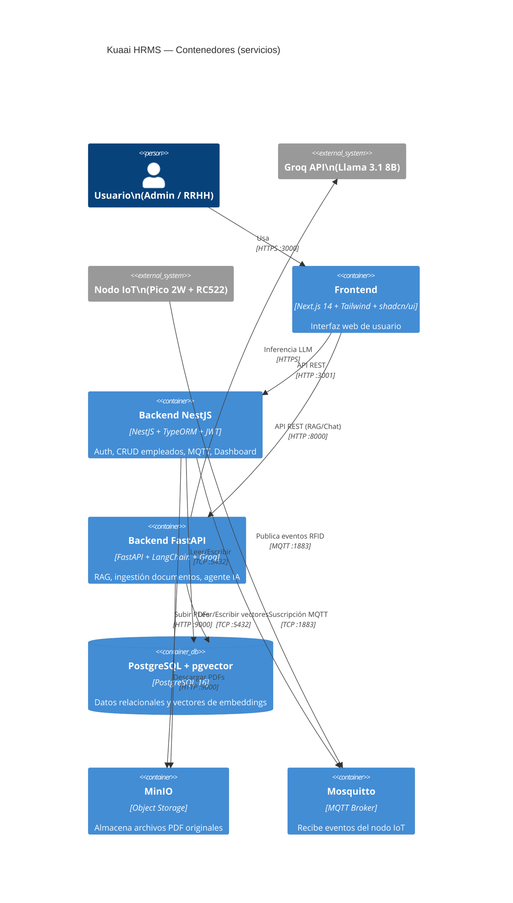

# Architecture Overview

## Descripción del sistema

**Kuaai** (del guaraní *kuaa*: saber, conocimiento) es un MVP de Sistema de Gestión de Recursos Humanos (HRMS) inteligente orientado a PyMEs de la región de Misiones, Argentina.

Combina tres capacidades principales:
1. **Control de asistencias IoT:** un nodo Raspberry Pi Pico 2W con lector RFID registra entradas y salidas de empleados en tiempo real mediante MQTT.
2. **Gestión de RRHH:** CRUD de empleados, métricas del dashboard y autenticación con roles (Admin / Responsable de RRHH).
3. **Agente RAG inteligente:** permite realizar consultas en lenguaje natural sobre documentos empresariales (reglamentos, políticas, manuales) y datos estructurados de asistencia.

---

## Patrones arquitectónicos

El sistema combina tres patrones arquitectónicos complementarios:

### 1. Orientada a eventos (Event-Driven)
El nodo IoT publica eventos MQTT al broker Mosquitto cada vez que un empleado acerca su tarjeta RFID. NestJS consume estos eventos de forma asincrónica y persiste los registros en PostgreSQL sin bloquear el hardware.

```
[Pico 2W + RFID] --MQTT--> [Mosquitto] --subscribe--> [NestJS AttendanceService]
```

### 2. Cliente-Servidor en tres capas
El frontend Next.js actúa como cliente que consume dos APIs REST independientes:
- **NestJS (:3001):** autenticación, empleados, dashboard — dominio HRMS
- **FastAPI (:8000):** documentos, chat con el agente — dominio IA

```
[Next.js] --REST--> [NestJS]    (auth, CRUD, dashboard)
[Next.js] --REST--> [FastAPI]   (RAG, chat, documentos)
```

### 3. Agéntico (Agentic RAG)
El agente LangChain orquesta dinámicamente múltiples herramientas para responder consultas en lenguaje natural. Decide en tiempo de ejecución qué herramienta usar (búsqueda semántica en pgvector, consultas SQL estructuradas, o ambas) según la intención del usuario.

```
[Pregunta usuario] --> [Agente ReAct] --> [Tool: search_documents / get_attendance / ...]
                                                    |
                                          [pgvector / PostgreSQL]
                                                    |
                                       [Groq LLM genera respuesta]
```

---

## Diagrama de contenedores (C4 — Nivel 2)



---

## Responsabilidades por servicio

| Servicio | Tecnología | Responsabilidades |
|----------|-----------|-------------------|
| **Frontend** | Next.js 14 + Tailwind + shadcn/ui | Login, dashboard de asistencias, gestión de empleados, carga de documentos, chat con el agente |
| **Backend NestJS** | NestJS + TypeORM + Passport | Auth JWT con roles, CRUD empleados, suscripción MQTT, lógica de asistencia, cron 16:00, métricas dashboard |
| **Backend FastAPI** | FastAPI + LangChain + Groq | Ingestión de PDFs, pipeline de embeddings, agente RAG, endpoints de chat, historial de conversación |
| **PostgreSQL + pgvector** | PostgreSQL 16 | Datos relacionales (empleados, asistencias, usuarios, documentos) + vectores de embeddings (384 dims) |
| **MinIO** | MinIO (S3-compatible) | Almacenamiento de archivos PDF originales subidos por usuarios |
| **Mosquitto** | Eclipse Mosquitto 2 | Broker MQTT que recibe eventos del nodo IoT y los distribuye a los suscriptores |
| **Nodo IoT** | Raspberry Pi Pico 2W + MicroPython | Lee UIDs de tarjetas RFID RC522 y publica en topic `attendance/checkin` |

---

## Stack tecnológico completo

| Componente | Tecnología | Versión |
|-----------|-----------|---------|
| Frontend | Next.js + TypeScript + Tailwind CSS + shadcn/ui | 14+ |
| Backend principal | NestJS + TypeScript | 10+ |
| Backend IA | FastAPI + Python | 0.115+ |
| Base de datos | PostgreSQL + pgvector | 16 |
| Object storage | MinIO | Latest |
| Mensajería IoT | MQTT + Eclipse Mosquitto | 2 |
| LLM | Groq API — Llama 3.1 8B Instant | — |
| Embeddings | SentenceTransformers — all-MiniLM-L6-v2 | 384 dims |
| Extracción PDF | Docling | 2+ |
| Framework agente | LangChain + LangGraph | 0.3+ / 0.2+ |
| ORM | TypeORM | 0.3+ |
| Autenticación | JWT + Passport.js | — |
| Contenedorización | Docker + Docker Compose | — |
| IoT Firmware | MicroPython | — |
| Hardware IoT | Raspberry Pi Pico 2W + RFID RC522 | — |
